# 人工智能的Python基础
## 写在前面的话

&emsp;&emsp;要想学习Yanshee的使用方法，我们必须学会一些python的基础编程，这样可以让我们更好的理解Yanshee机器人的运行原理以及一些功能和sdk使用等等。另外python是深度学习使用的最常见的工具之一，所以学习python是非常必要的。

## Python开发环境安装：

&emsp;&emsp;主要IDE：Jupyter notebook、Pycharm两种建议使用jupyter它是一种网页式编程工具，既可以编程又可以写代码笔记，还可以分享给其它想要的开发人员。
&emsp;&emsp;jupyter下载界面：[http://jupyter.org/install.html](http://jupyter.org/install.html)

&emsp;&emsp;Yanshee机器人命令行默认安装了python 我们直接打开终端python xxx.py就可以执行结果。我们这里使用Yanshee自带的命令行执行python脚本。另外我们所有举例都通过python2.7来讲解。

## Python基础部分

### 第一个python程序

命令行输入：```nano hello.py```

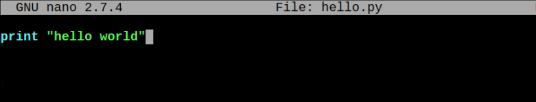
  
执行文件 ```python hello.py```

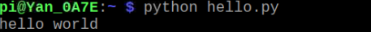
 
### 基本输入输出

输入raw_input()、输出print

继续编辑 ```hello.py``` 

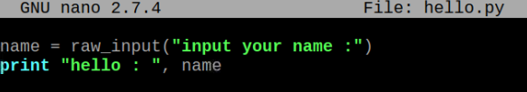

 
执行文件 ```python hello.py```

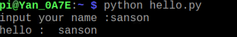

 
### 基础语法

数据类型和变量：
Python常用的数据类型包括以下种类：

**整数：** Python可以处理任意大小的整数，当然包括负整数，在程序中的表示方法和数学上的写法一样，例如：1，100，-8080，0，等等。
计算机由于使用二进制，所以，有时候用十六进制表示整数比较方便，十六进制用0x前缀和0-9，a-f表示，例如：0xff00，0xa5b4c3d2，等等。

**浮点数：** 也就是小数。例如1.23，3.14，-9.01，等等。但是对于很大或很小的浮点数，就必须用科学计数法表示，把10用e替代，1.23x109就是1.23e9，或者12.3e8，0.000012可以写成1.2e-5，等等。

**字符串：** 字符串是以''或""括起来的任意文本，比如'abc'，"xyz"等等。

**布尔值：** 布尔值和布尔代数的表示完全一致，一个布尔值只有True、False两种值，要么是True，要么是False。布尔值可以用and、or和not运算。

**空值：** 空值是Python里一个特殊的值，用None表示。None不能理解为0，因为0是有意义的，而None是一个特殊的空值。

**变量：** 变量的概念基本上和初中代数的方程变量是一致的，只是在计算机程序中，变量不仅可以是数字，还可以是任意数据类型。变量在程序中就是用一个变量名表示了，变量名必须是大小写英文、数字和_的组合，且不能用数字开头。例如：
A = 1 定义A是一个整数。v_100 = “hello” v_100是一个初始值为hello的字符串变量。

**常量：** 所谓常量就是不能变的变量，比如常用的数学常数π就是一个常量。在Python中，通常用全部大写的变量名表示常量。例如：PI = 3.1415926。
Python保留的关键字：
在编程中这些关键字不能用于变量定义，因为他们是python已经用的默认编程语句。
|and|exec|not|
|:---------|:---------|
assert	finally	or
break	for	pass
class	from	print
continue	global	raise
def	if	return
del	import	try
elif	in	while
else	is	with
except	lambda	yield

**代码缩进规则：** 在python中代码块是对齐的方式是通过空格或tab键来完成对齐的，而且python中是强要求格式的。如果某个代码块没有对齐就会报错。

**Python的注释：** 为了增加代码的可读性，我们经常需要为他们写上一些必要的注释。
python中单行注释采用 # 开头。多行注释采用： 三个单引号或者三个双引号方式。

**中文编码问题：**
由于Python源代码是一个文本文件，所以，当你的源代码中包含中文的时候，在保存源代码时，就需要务必指定保存为UTF-8编码。当Python解释器读取源代码时，为了让它按UTF-8编码读取，我们通常在文件开头写上这两行：

```
#！usr/bin/env python
# -*- coding: utf-8 -*-
```

第一行注释是为了告诉Linux/OS X系统，这是一个Python可执行程序，Windows系统会忽略这个注释；第二行注释是为了告诉Python解释器，按照UTF-8编码读取源代码，否则，在源代码中写的中文输出可能会有乱码。

我们在前面的 ```hello.py``` 加入中文测试一下：

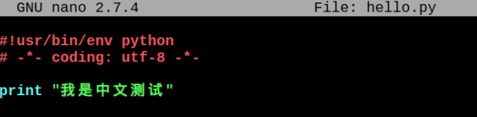
 
执行文件：```python hello.py``` 如下结果输出：

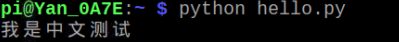
 
list和tuple：

Python内置的一种数据类型是列表：list。list是一种有序的集合，可以随时添加和删除其中的元素。比如，列出小组班级成员的名字，就可以用一个list表示：
```classmates = [‘bob’,’tony’,’tracy’]```
 例如：编辑一个 ```list.py``` 如下：

 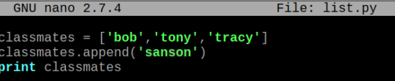
 
执行命令：```python list.py ```

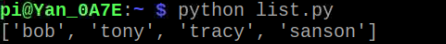
 
List支持插入、删除、修改某个或某些元素。
list里面的元素的数据类型也可以不同，比如：L = [‘ok’,100,True]
另一种有序列表叫元组：tuple。tuple和list非常类似，但是tuple一旦初始化就不能修改。

举例：```classmates = (‘Michael’,’Bob’,’Tracy’)```
Dict字典关键字：Python内置了字典：dict的支持，dict全称dictionary，在其他语言中也称为map，使用键-值（key-value）存储，具有极快的查找速度。
例如：d = {‘Michael’: 20,‘Bob’:35,’Tracy’:55 } 我们定义三个不同的人三个年龄段的统计字典。
在Yanshee的命令行输入：nano dict.py编辑文件建立脚本。

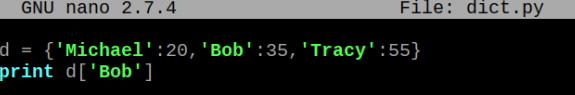
 
执行命令：```python dict.py```
 
 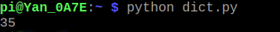

字典很好的建立了数据之间的关系，简化了编程。

条件判断与循环：
条件判断语句：通过条件判断语句实现自然逻辑转化，是编程语言中最为基础的逻辑实现之一。If语句：条件 加冒号 后面可以连接elif 这个是else和if的简写，也可以连接else冒号。举例如下：

```
if a>= 10 :
    print 'ok'
elif a>=20 :
    print 'sorry'
elif a>=30 :
    print 'yes'
else a>= 40 :
    print 'who'
```
    
循环语句：主要包括for语句和循环语句。
for语句举例：

```
sum = 0
for x in [ 0,1,2,3,4]:
    sum = sum + x
print sum
```

上面这段代码表示求取0加到4的和。另外我们使用python自带的range()函数来生成一个整数序列。

```
sum = 0
for x in range(5) :
    sum = sum + x
print sum
```

我们保存下这段代码为```sum.py```
然后在命令行执行```python sum.py```

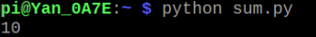
 
while 循环语句举例:

```
sum = 0 
n = 4
while n > 0 :
    sum = sum + n
    n = n - 1
print sum
```

我们发现用while表示当一种条件成立时的运算某些逻辑的过程。我们经常会用while True：这样的格式来表示永久循环等事情。

函数：函数是什么呢？函数是一种通用逻辑的抽象，用来构造重复逻辑来减轻编程复杂度。例如：我们需要一个加法函数用来计算两个数相加、需要一个求取圆面积的函数用来求得任意半径的圆的面积。函数就是一种数学算法的抽象。可以分为自定义函数和调用python库函数两种。

自定义函数：

```
#定义一个函数
def sum( a , b ) :
    c = a + b
    return c
#函数第一次调用
s1 = sum ( 1323 , 9987)
print s1
#函数第二次调用
s2 = sum ( 2231 , 3334)
print s2
```

&emsp;&emsp;大家看到我们定义了加法函数，然后就可以重复调用这个函数来实现任意整数的加法了。极大的简化了代码重复利用的逻辑。其中 a b 是参数 可以没有也可以多个。而后面的冒号是必须的，下面的语句必须缩进格式完成函数模块编写。
调用python库函数：
     例如：str(10) 输出结果 ‘10’这个函数表示将整数转化成字符格式。abs（-20）输出结果 20 , 这个函数表示求取一个整数的绝对值。等等这种python自带的函数给我们的程序编写带来了许多便利。更多内置函数请查看：[http://www.runoob.com/python/python-built-in-functions.html](http://www.runoob.com/python/python-built-in-functions.html)

python模块： 为了更好的组织python代码，让我们的代码表现的更有结构和层次感，我们使用import关键字来导入模块。而模块可以分为内置模块和自定义模块和包定义三部分。

内置模块：python内置了许多函数模块，我们直接导入之后调用就可以了。例如：

```
#引入时间模块
import time
now = time.time()
print now
```

我们导入了时间模块，然后获取了当前的时间戳，并把它打印出来。

自定义模块：我们可以自己定义一些python文件然后把它作为模块来让其它python文件调用。例如：先定义一个```hello.py```

文件，然后在同一目录下写一个test.py文件如下：

```hello.py```

```
#!/usr/bin/env python
def welcome_func ( a ) :
     print "welcome : " , a
```

```
test.py 
#!/usr/bin/env python
```

```
#导入hello模块
import hello
#调用函数成员
hello.welcome_func("sanson")
```

然后我们运行python test.py 输出结果：

```
welcome : sanson
```

### python包定义：

&emsp;&emsp;包是一个分层次的文件目录结构，它定义了一个由模块及子包，和子包下的子包等组成的 Python 的应用环境。简单来说，包就是文件夹，但该文件夹下必须存在 __init__.py 文件, 该文件的内容可以为空。__init__.py 用于标识当前文件夹是一个包。
举例：我们创建一个包名：package文件夹里面包含三个文件foo1.py,foo2.py和一个__init__.py文件。另外和package同目录下有一个test.py文件。
目录结构如下：

```
test.py 
package
|--- __init__.py
|--- foo1.py
|--- foo2.py 

foo1.py
#!/usr/bin/python
# -*- coding: UTF-8 -*- 

def hello1(): 
    print "hello I am foo1"

foo2.py
#!/usr/bin/python 
# -*- coding: UTF-8 -*- 

def hello2():
    print "hello I am foo2"

__init__.py
#!/usr/bin/python 
# -*- coding: UTF-8 -*- 

if __name__ == '__main__': 
    print '作为主程序运行' 
else:
    print 'package 初始化'
```


我们创建test.py文件来调用package包。

```
test.py
#!/usr/bin/python 
# -*- coding: UTF-8 -*- 

# 导入 python包 
from package.foo1 import hello1 
from package.foo2 import hello2
 
hello1() 
hello2()

```

执行```test.py``` 输出结果如下：

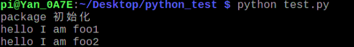
 

## 高级python编程

### 面向对象编程

面向对象的思想主要来自于生活，当我们发现只是有一个函数无法解决很多生活问题时，干脆用一个类来定义某个对象，来形容某种发生然后规定某种行为。于是就有了类和继承等概念的出现。

类(Class): 用来描述具有相同的属性和方法的对象的集合。它定义了该集合中每个对象所共有的属性和方法。对象是类的实例。
方法：类中定义的函数。

类变量：类变量在整个实例化的对象中是公用的。类变量定义在类中且在函数体之外。类变量通常不作为实例变量使用。

数据成员：类变量或者实例变量用于处理类及其实例对象的相关的数据。

实例变量：定义在方法中的变量，只作用于当前实例的类。

继承：即一个派生类（derived class）继承基类（base class）的字段和方法。继承也允许把一个派生类的对象作为一个基类对象对待。例如，有这样一个设计：一个Dog类型的对象派生自Animal类，这是模拟"是一个（is-a）"关系（例图，Dog是一个Animal）。

实例化：创建一个类的实例，类的具体对象。

对象：通过类定义的数据结构实例。对象包括两个数据成员（类变量和实例变量）和方法。

方法重写：如果从父类继承的方法不能满足子类的需求，可以对其进行改写，这个过程叫方法的覆盖（override），也称为方法的重写。

下面是一个简单的类示例：

```
#!/usr/bin/python

class MyClass:
 """一个简单的类实例""" 
    teacher = 6
    classmates = 54
    def our_goal(self):
        print '考上大学' 
# 实例化类
x = MyClass() 
# 访问类的属性和方法 
print("我们班级有%d位老师："% x.teacher)
print("我们班级的目标是：" % x.our_goal())
```

执行结果如下：

```
我们班级有6位老师
我们班级的目标是：考上大学
```

我们看到一个简单的班级类说明了 有6位老师，54位同学，他们的目标是考上大学。这就是一个具有意义的类的集合举例。
我们看看一个完整的类如下：

```
#!/usr/bin/python

class MyClass:
 """一个班级类实例""" 
    teacher = 6
    classmateCount = 0
    def __init__(self, n,a):
        self.name = n 
        self.age = a
        MyClass.classmateCount += 1 
    def displayCount(self): 
        print "Total classmates %d" % MyClass.classmateCount 
    def displayClassnumber(self): 
        print "Name: ", self.name, ", Age: ", self.age

#创建 MyClass 类的第一个对象
class1 = MyClass("Tony", 16) 
#创建 Employee 类的第二个对象
class2 = MyClass("Sanson", 18)
class1.displayClassnumber()
class2.displayClassnumber()
print "Total classmates %d" % MyClass.classmateCount
```


执行以上代码输出：

```
Name: Tony , Age: 16
Name: Sanson , Age: 18
Total classmates 2
```

第一种方法__init__()方法是一种特殊的方法，被称为类的构造函数或初始化方法，当创建了这个类的实例时就会调用该方法

Self：类的方法与普通的函数只有一个特别的区别——它们必须有一个额外的第一个参数名称, 按照惯例它的名称是 self。self 代表类的实例，self 在定义类的方法时是必须有的，虽然在调用时不必传入相应的参数。

继承：子类继承父类的所有属性并添加新的属性成为一个新类。我们这里主要讲解单例继承。

```
#!/usr/bin/python

Class myclass:
 """一个班级类实例""" 
    name = ''
    age = 0
    def __init__(self, n,a):
        self.name = n 
        self.age = a
    def display(self): 
        print "Name: ", self.name, ", Age: ", self.age

#单继承示例
Class student(myclass):
 """一个继承类实例""" 
    grade = ''
    def __init__(self, n,a,g):
        #调用父类的构函 
        myclass.__init__(self,n,a)
        self.grade = g
        def display(self): 
        print "姓名: ", self.name, ", 年龄: ", self.age, "岁, 年级: 高", self.grade

s = student('Tony', 16 , 3)
s.display()
```

执行上面代码输出如下：

```
姓名: Tony  年龄:16岁，年级：高3
```

通过上面的例子我们看到通过简单的继承子类获得了父类的所有属性，并添加了自己更加完善的属性进去。完成了特定功能的实现的目的。

### 进程与线程
多线程可以让两个分别顺序执行的任务同时开始执行。形式上类似并发的意思。
       
什么叫“多任务”呢？简单地说，就是操作系统可以同时运行多个任务。打个比方，你一边在用浏览器上网，一边在听MP3，一边在用Word赶作业，这就是多任务，至少同时有3个任务正在运行。还有很多任务悄悄地在后台同时运行着，只是桌面上没有显示而已。

下面这个例子就是两个线程同时工作的：

```
#coding=utf-8 

import threading
from time import ctime,sleep
 
def thread1(func): 
    for i in range(2): 
        print "I was listening to %s. %s" %(func,ctime())
        sleep(1)
def thread2(func):
    for i in range(2):
        print "I was at the %s! %s" %(func,ctime()) 
        sleep(5)

if __name__ == '__main__':
    threads = []
    t1 = threading.Thread(target=thread1,args=('hello',)) 
    threads.append(t1) 
    t2 = threading.Thread(target=thread2,args=('ok',))                             
    threads.append(t2)                                                                                                                       

    for t in threads:
        t.setDaemon(True) 
        t.start()

for t in threads:
    t.join()

    print "all over %s" %ctime()
```

### 网络编程
主要是socket编程。Socket又称"套接字"，应用程序通常通过"套接字"向网络发出请求或者应答网络请求，使主机间或者一台计算机上的进程间可以通讯。

简单举例：

服务端：
我们使用 socket 模块的 socket 函数来创建一个 socket 对象。socket 对象可以通过调用其他函数来设置一个 socket 服务。现在我们可以通过调用 bind(hostname, port) 函数来指定服务的 port(端口)。接着，我们调用 socket 对象的 accept 方法。该方法等待客户端的连接，并返回 connection 对象，表示已连接到客户端。

```
#!/usr/bin/python
# -*- coding: UTF-8 -*-

# 文件名：server.py
import socket               # 导入 socket 模块

s = socket.socket()         # 创建 socket 对象
host = socket.gethostname() # 获取本地主机名
port = 12345                # 设置端口
s.bind((host, port))        # 绑定端口
s.listen(5)                 # 等待客户端连接
while True:
    c, addr = s.accept()     # 建立客户端连接。
    print '连接地址：', addr
    c.send('这是一个网络编程测试！')
c.close()                # 关闭连接
```

客户端：

接下来我们写一个简单的客户端实例连接到以上创建的服务。端口号为 12345。
socket.connect(hosname, port ) 方法打开一个 TCP 连接到主机为 hostname 端口为 port 的服务商。连接后我们就可以从服务端获取数据，记住，操作完成后需要关闭连接。

```
#!/usr/bin/python
# -*- coding: UTF-8 -*-
# 文件名：client.py

import socket               # 导入 socket 模块

s = socket.socket()         # 创建 socket 对象
host = socket.gethostname() # 获取本地主机名
port = 12345                # 设置端口号
s.connect((host, port))
print s.recv(1024)
s.close()
  ```
  
在Yanshee身上打开两个命令行终端，分别执行两个脚本如下：

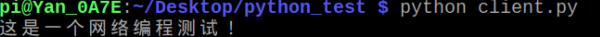

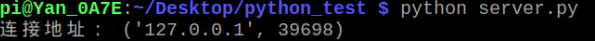

 

### GUI编程 (Tkinter)
GUI编程是一个非常强大的界面编程，我们主要简单讲解通过Tkinter来编程。
先举一个简单的例子，用GUI实现的Hello World：

```
#!/usr/bin/env python
# -*- coding: utf-8 -*-

#导入sys和Tkinter模块 
import sys, Tkinter 

#创建主窗口 
root = Tkinter.Tk() 
root.title("Hello World") 
root.minsize(300, 50) 

def callback():
    print "OK ByeBye!"
    sys.exit()
```

#创建标签 
Tkinter.Label(root, text="Hello World").pack() 
#创建按钮并把命令绑定到退出 
Tkinter.Button(root, text="Exit", command=callback).pack() 

#启动主循环 
root.mainloop()

保存为helloTk.py之后执行如下：


 

注意：Python3.x 版本使用的库名为 tkinter,即首写字母 T 为小写。
Tkinter组件包括了15种，具体可以参考http://www.runoob.com/python/python-gui-tkinter.html
下面是一个综合示例：用Tkinter写一个计算器。


    #!/usr/bin/python
    # _*_ coding: utf-8 -*-
    
    import Tkinter #导入Tkinter模块
    
    root  = Tkinter.Tk()
    root.minsize(280,500)
    root.title('Yanshee的计算器')
    
    #1.界面布局
    #显示面板
    result = Tkinter.StringVar()
    result.set(0)                           #显示面板显示结果1，用于显示默认数字0
    result2 = Tkinter.StringVar()           #显示面板显示结果2，用于显示计算过程
    result2.set('')
    
    #显示板
    label = Tkinter.Label(root,font = ('微软雅黑',20),bg = '#EEE9E9',bd ='9',fg = '#828282',anchor = 'se',textvariable = result2)
    label.place(width = 280,height = 170)
    label2 = Tkinter.Label(root,font = ('微软雅黑',30),bg = '#EEE9E9',bd ='9',fg = 'black',anchor = 'se',textvariable = result)
    label2.place(y = 170,width = 280,height = 60)
    
    #数字键按钮
    btn7 = Tkinter.Button(root,text = '7',font = ('微软雅黑',20),fg = ('#4F4F4F'),bd = 0.5,command = lambda : pressNum('7'))
    btn7.place(x = 0,y = 285,width = 70,height = 55)
    btn8 = Tkinter.Button(root,text = '8',font = ('微软雅黑',20),fg = ('#4F4F4F'),bd = 0.5,command = lambda : pressNum('8'))
    btn8.place(x = 70,y = 285,width = 70,height = 55)
    btn9 = Tkinter.Button(root,text = '9',font = ('微软雅黑',20),fg = ('#4F4F4F'),bd = 0.5,command = lambda : pressNum('9'))
    btn9.place(x = 140,y = 285,width = 70,height = 55)
    
    btn4 = Tkinter.Button(root,text = '4',font = ('微软雅黑',20),fg = ('#4F4F4F'),bd = 0.5,command = lambda : pressNum('4'))
    btn4.place(x = 0,y = 340,width = 70,height = 55)
    btn5 = Tkinter.Button(root,text = '5',font = ('微软雅黑',20),fg = ('#4F4F4F'),bd = 0.5,command = lambda : pressNum('5'))
    btn5.place(x = 70,y = 340,width = 70,height = 55)
    btn6 = Tkinter.Button(root,text = '6',font = ('微软雅黑',20),fg = ('#4F4F4F'),bd = 0.5,command = lambda : pressNum('6'))
    btn6.place(x = 140,y = 340,width = 70,height = 55)
    
    btn1 = Tkinter.Button(root,text = '1',font = ('微软雅黑',20),fg = ('#4F4F4F'),bd = 0.5,command = lambda : pressNum('1'))
    btn1.place(x = 0,y = 395,width = 70,height = 55)
    btn2 = Tkinter.Button(root,text = '2',font = ('微软雅黑',20),fg = ('#4F4F4F'),bd = 0.5,command = lambda : pressNum('2'))
    btn2.place(x = 70,y = 395,width = 70,height = 55)
    btn3 = Tkinter.Button(root,text = '3',font = ('微软雅黑',20),fg = ('#4F4F4F'),bd = 0.5,command = lambda : pressNum('3'))
    btn3.place(x = 140,y = 395,width = 70,height = 55)
    btn0 = Tkinter.Button(root,text = '0',font = ('微软雅黑',20),fg = ('#4F4F4F'),bd = 0.5,command = lambda : pressNum('0'))
    btn0.place(x = 70,y = 450,width = 70,height = 55)
    
    #运算符号按钮
    btnac = Tkinter.Button(root,text = 'AC',bd = 0.5,font = ('黑体',20),fg = 'orange',command = lambda :pressCompute('AC'))
    btnac.place(x = 0,y = 230,width = 70,height = 55)
    btnback = Tkinter.Button(root,text = '←',font = ('微软雅黑',20),fg = '#4F4F4F',bd = 0.5,command = lambda:pressCompute('b'))
    btnback.place(x = 70,y = 230,width = 70,height = 55)
    btndivi = Tkinter.Button(root,text = '÷',font = ('微软雅黑',20),fg = '#4F4F4F',bd = 0.5,command = lambda:pressCompute('/'))
    btndivi.place(x = 140,y = 230,width = 70,height = 55)
    btnmul = Tkinter.Button(root,text ='×',font = ('微软雅黑',20),fg = "#4F4F4F",bd = 0.5,command = lambda:pressCompute('*'))
    btnmul.place(x = 210,y = 230,width = 70,height = 55)
    btnsub = Tkinter.Button(root,text = '-',font = ('微软雅黑',20),fg = ('#4F4F4F'),bd = 0.5,command = lambda:pressCompute('-'))
    btnsub.place(x = 210,y = 285,width = 70,height = 55)
    btnadd = Tkinter.Button(root,text = '+',font = ('微软雅黑',20),fg = ('#4F4F4F'),bd = 0.5,command = lambda:pressCompute('+'))
    btnadd.place(x = 210,y = 340,width = 70,height = 55)
    btnequ = Tkinter.Button(root,text = '=',bg = 'orange',font = ('微软雅黑',20),fg = ('#4F4F4F'),bd = 0.5,command = lambda :pressEqual())
    btnequ.place(x = 210,y = 395,width = 70,height = 110)
    btnper = Tkinter.Button(root,text = '%',font = ('微软雅黑',20),fg = ('#4F4F4F'),bd = 0.5,command = lambda:pressCompute('%'))
    btnper.place(x = 0,y = 450,width = 70,height = 55)
    btnpoint = Tkinter.Button(root,text = '.',font = ('微软雅黑',20),fg = ('#4F4F4F'),bd = 0.5,command = lambda:pressCompute('.'))
    btnpoint.place(x = 140,y = 450,width = 70,height = 55)
    
    #操作函数
    lists = []                            #设置一个变量 保存运算数字和符号的列表
    isPressSign = False                  #添加一个判断是否按下运算符号的标志,假设默认没有按下按钮
    isPressNum = False
    #数字函数
    def pressNum(num):                   #设置一个数字函数 判断是否按下数字 并获取数字将数字写在显示版上
        global lists                     #全局化lists和按钮状态isPressSign
        global isPressSign
        if isPressSign == False:
            pass
        else:                            #重新将运算符号状态设置为否
            result.set(0)
            isPressSign = False
    
        #判断界面的数字是否为0
        oldnum = result.get()             #第一步
        if oldnum =='0':                 #如过界面上数字为0 则获取按下的数字
            result.set(num)
        else:                            #如果界面上的而数字不是0  则链接上新按下的数字
            newnum = oldnum + num
            result.set(newnum)            #将按下的数字写到面板中
    
    #运算函数
    def pressCompute(sign):
        global lists
        global isPressSign
        num = result.get()              #获取界面数字
        lists.append(num)               #保存界面获取的数字到列表中
        lists.append(sign)              #讲按下的运算符号保存到列表中
        isPressSign = True
        if sign =='AC':                #如果按下的是'AC'按键，则清空列表内容，讲屏幕上的数字键设置为默认数字0
            #lists.clear()
        del lists[:]
            result.set(0)
        if sign =='b':                 #如果按下的是退格‘’，则选取当前数字第一位到倒数第二位
            a = num[0:-1]
            #lists.clear()
        del lists[:]
            result.set(a)
    
    #获取运算结果函数
    def pressEqual():
        global lists
        global isPressSign
        curnum = result.get()           #设置当前数字变量，并获取添加到列表
        lists.append(curnum)
        computrStr = ''.join(lists)     #讲列表内容用join命令将字符串链接起来
        endNum = eval(computrStr)       #用eval命令运算字符串中的内容
        result.set(endNum)                   #讲运算结果显示到屏幕1
        result2.set(computrStr)         #将运算过程显示到屏幕2
        #lists.clear()                   #清空列表内容
        del lists[:]
    
    #启动主循环 
    root.mainloop()

保存为calculator.py之后，执行结果如下：
 
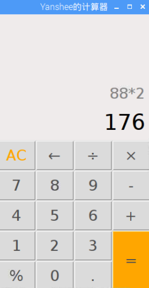


## 思路总结
经过本课程的学习，我们基本掌握了一些python的基础语法和几种高级用法，然而python的用法远远不止于此，比如用于web开发、用于邮件系统、matlab库仿真等请大家根据具体的项目需求自己多实践多练习，以求达到比较高的python编程水平。我们的Yanshee机器人的视觉和SDK部分就使用了大量的python编程。最后现代编程技术已经加入了很多网络模板技术、编程模式技术等等所以我们在获得基本编程方法之后，要懂得融会贯通各种技术以求完成更好的项目需求和效果。

#### 参考教程：  

[http://www.runoob.com/python/python-intro.html](http://www.runoob.com/python/python-intro.html)

[https://www.liaoxuefeng.com/wiki/0014316089557264a6b348958f449949df42a6d3a2e542c000](https://www.liaoxuefeng.com/wiki/0014316089557264a6b348958f449949df42a6d3a2e542c000)
