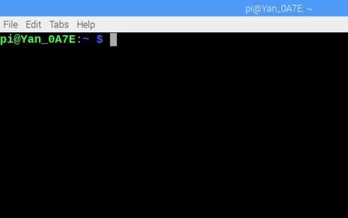
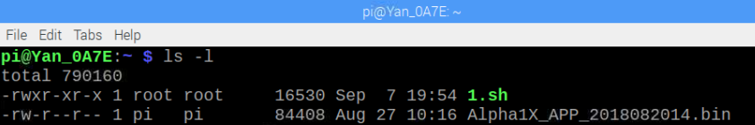
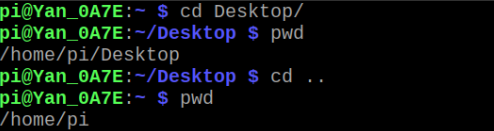

# 机器人终端常用linux命令说明       

## 本文目标：

&emsp;&emsp;通过这篇附录来说明Yanshee的Debian系统所需的主要Linux命令操作，希望对你学习python开发、学习人工智能开发起到基础查阅作用。

## 本文背景：
&emsp;&emsp;Linux作为一种开源的操作系统，是目前为止最受欢迎的操作系统之一。从编程到电子设备操作，很多嵌入式设备开发都需要在Linux环境下做开发，因此为了我们更好地在Yanshee机器人上做开发特编写了这段附录——Linux常用命令说明书。
## 环境准备：
### Yanshee命令终端打开说明：
&emsp;&emsp;连接HDMI显示器或VNC登录到机器人上，出现树莓派界面，找到左上角图标位置如图所示：  

  

&emsp;&emsp;单击命令行终端图标或快捷键Ctrl+Alt+T打开终端命令行。类似于windows的cmd命令行。如下图所示：  

  
 

## 常用命令操作说明：
### 1、ls命令
&emsp;&emsp;格式：：ls [选项] [目录或文件]  
 
&emsp;&emsp;功能：对于目录，列出该目录下的所有子目录与文件；对于文件，列出文件名以及其他信息。  
 
&emsp;&emsp;选项：  
 
&emsp;&emsp;-a ：列出目录下的所有文件，包括以 . 开头的隐含文件。  
 
&emsp;&emsp;-d ：将目录像文件一样显示，而不是显示其他文件。  
 
&emsp;&emsp;-i ：输出文件的i节点的索引信息。  
 
&emsp;&emsp;-k ：以k字节的形式表示文件的大小。  
 
&emsp;&emsp;-l ：列出文件的详细信息。  
 
&emsp;&emsp;-n ：用数字的UID,GID代替名称。  
 
&emsp;&emsp;-F : 在每个文件名后面附上一个字符以说明该文件的类型，“*”表示可执行的普通文 件；“/”表示目录；“@”表示符号链接；“l”表示FIFOS；“=”表示套接字。  

&emsp;&emsp;在终端输入ls –l 命令如下：  

 
&emsp;&emsp;显示了当前目录下所有文件的权限、创建时间和文件大小等信息。  

### pwd命令                                                                                                                                                                 
&emsp;&emsp;格式： pwd  
                                                                                                                                                                  
&emsp;&emsp;功能：显示出当前工作目录的绝对路径。  

 
&emsp;&emsp;可见，我们Yanshee的默认端口路径是/home/pi  

### cd命令 
&emsp;&emsp;格式：cd [目录名称]   

&emsp;&emsp;功能：切换目录到特定目录一下。  

&emsp;&emsp;常用选项：  
 
&emsp;&emsp;cd .. 返回上一级目录。  
 
&emsp;&emsp;cd ../.. 将当前目录向上移动两级。  
 
&emsp;&emsp;cd - 返回最近访问目录。  

 
&emsp;&emsp;我们先切换目录到桌面目录，然后再切换目录回到上一层目录通过pwd查看得到验证。  

### touch命令
 
&emsp;&emsp;格式：touch[选项] 文件名…  
 
&emsp;&emsp;功能：touch命令参数可以更改文档或目录的日期时间，包括存取时间和更改时间，或者新建一个不存在的文件。  
 
&emsp;&emsp;常用选项：  
 
&emsp;&emsp;-a 仅改变指定文件的存取时间。  
 
&emsp;&emsp;-c 或–no-creat 不创建任何文件。
 
&emsp;&emsp;-m 仅改变指定文件的修改时间。  
 
&emsp;&emsp;-d 使用指定的日期时间，而非现在的时间。  
 
&emsp;&emsp;-f 此参数将忽略不予处理，仅负责解决BSD版本touch指令的兼容性问题。  
 
### mkdir命令 
&emsp;&emsp;格式：mkdir [选项] dirname…  
 
&emsp;&emsp;功能：mkdir命令用来创建目录。  
 
&emsp;&emsp;常用选项：  
 
&emsp;&emsp;-p –parents 可以是一个路径名称。此时若路竞争的某些目录尚不存在，加上此选项后，系统将自动建立好那些尚不存在的目录，即一次可以建立多个目录。  
 
&emsp;&emsp;-m –mode=MODE 将新建目录的存取权限设置为MODE，存取权限用给定的八进制数字表示。  
 
### cat命令 
&emsp;&emsp;格式：cat [选项] [文件]  
 
&emsp;&emsp;功能：查看目标文件的内容。  
 
&emsp;&emsp;常用选项：  
 
&emsp;&emsp;-b 对非空输出行编号。  
 
&emsp;&emsp;-n 对输出的所有行编号。  
 
&emsp;&emsp;-s 不输出多行空行。  
 
### nano命令
    
&emsp;&emsp;格式：nano 文件名  

&emsp;&emsp;功能：编辑文件  

&emsp;&emsp;常用选项：  
     
&emsp;&emsp;-h 查看更多选项。  

&emsp;&emsp;光标控制  

&emsp;&emsp;移动光标：使用用方向键移动。  

&emsp;&emsp;选择文字：按住鼠标左键拖到。  

&emsp;&emsp;复制、剪切和粘贴  

&emsp;&emsp;复制一整行：Alt+6  

&emsp;&emsp;剪切一整行：Ctrl+K  

&emsp;&emsp;删除一整行：Ctrl+K  

&emsp;&emsp;粘贴：Ctrl+U  

&emsp;&emsp;如果需要复制／剪贴多行或者一行中的一部分，先将光标移动到需要复制／剪贴的文本的开头，按Ctrl+6（或者Alt+A）做标记，然后移动光标到 待复制／剪贴的文本末尾。这时选定的文本会反白，用Alt+6来复制，Ctrl+K来剪贴。若在选择文本过程中要取消，只需要再按一次Ctrl+6。  

&emsp;&emsp;搜索

&emsp;&emsp;按Ctrl+W，然后输入你要搜索的关键字，回车确定。这将会定位到第一个匹配的文本，接着可以用Alt+W来定位到下一个匹配的文本。  

&emsp;&emsp;翻页  

&emsp;&emsp;用Ctrl+Y到上一页，Ctrl+V到下一页  

&emsp;&emsp;保存  

&emsp;&emsp;使用Ctrl+O来保存所做的修改  

&emsp;&emsp;退出  

&emsp;&emsp;按Ctrl+X  

&emsp;&emsp;如果你修改了文件，下面会询问你是否需要保存修改。输入Y确认保存，输入N不保存，按Ctrl+C取消返回。  

&emsp;&emsp;如果输入了Y，下一步会让你输入想要保存的文件名。如果不需要修改文件名直接回车就行；若想要保存成别的名字（也就是另存为）则输入新名称然后确 定。这个时候也可用Ctrl+C来取消返回。  

### rm命令
              
&emsp;&emsp;格式：rm [选项] 文件列表   

&emsp;&emsp;功能：rm命令删除文件或目录。  
                                                                                                                              
&emsp;&emsp;常用选项：  
                                                                                                                                                              
&emsp;&emsp;-f –force 忽略不存在的文件，并且不给出提示信息。  
                                                                                             
&emsp;&emsp;-r -R，–recursive 递归地删除指定目录及其下属的各级子目录和相应的文件。  
                                                     
&emsp;&emsp;-i 交互式删除文件。  
                                                                                                                                              
&emsp;&emsp;说明：rm命令删除指定的文件，默认情况下，它不能删除目录。如果文件不可写，则标准输入是tty（终端设备）。如果没有给出选项-f或者–force，rm命令删除之前会提示用户是否删除该文件；如果用户没有回答y或者Y，则不删除该文件。  
                                                            
### man 命令                                                                                                                                                                   
&emsp;&emsp;格式：man [选项] 命令   
                                                                                                                                                
&emsp;&emsp;功能：man命令格式化并显示某一命令的联机帮助手册页。  
                                                                                 
&emsp;&emsp;常用选项：  
                                                                                                                                                                
&emsp;&emsp;-k 根据关键字搜索联机帮助。  
                                                                                                                                  
&emsp;&emsp;num 只在第num章节找。  
                                                                                                                                         
&emsp;&emsp;-a 将所有章节的都显示出来。  
                                                                                                                                              
&emsp;&emsp;说明：手册分为8章：  
                                                                                                                                                      
&emsp;&emsp;1. 一般用户的命令；  
 
&emsp;&emsp;2. 系统调用；  
 
&emsp;&emsp;3. C语言函数库；  
 
&emsp;&emsp;4. 有关驱动程序和系统设备的解释；  
 
&emsp;&emsp;5. 配置文件的解释；  
 
&emsp;&emsp;6. 游戏程序的命令；   

&emsp;&emsp;7. 有用的杂类命令，如宏命令包等；  
 
&emsp;&emsp;8. 有关系统维护和管理的命令。  
 
### cp命令 
&emsp;&emsp;格式：cp [选项] 源文件或目录 目标文件或目录 

&emsp;&emsp;功能：复制文件或目录。 

&emsp;&emsp;常用选项： 

&emsp;&emsp;-f –force 强行复制文件或目录，不论文件或目录是否已经存在。
 
&emsp;&emsp;-d 复制时保留文件链接。 

&emsp;&emsp;-i –interactive覆盖文件之前先询问用户。 

&emsp;&emsp;-r 递归处理，将指定目录下的文件与子目录一并处理。若源文件或目录的形态，不属于目录或符号链接，则一律视为普通文件处理。
 
&emsp;&emsp;-R 或–recursive递归处理，将指定目录下的文件及子目录一并处理。
  
### mv命令                                                                                                                                                              
&emsp;&emsp;格式：mv [选项] 源文件或目录 目标文件或目录  
                                                                                                  
&emsp;&emsp;功能：mv命令对文件或目录重新命名，或者将文件从一个目录移到另一个目录中。 
                                
&emsp;&emsp;常用选项：   
                                                                                                                                                          
&emsp;&emsp;-f force 强制的意思，如果目标文件已经存在，不会询问而直接覆盖。  

&emsp;&emsp;-i 若目标文件（destination）已经存在时，就会询问是否覆盖。
 
### tail命令                                                                                                                                                                   
&emsp;&emsp;格式：tail [选项] [文件]      
                                                                                                                                      
&emsp;&emsp;功能：用于显示指定文件的末尾，不指定文件时，作为输入信息进行处理。常用查看日志文件。 
                                                                                                                                                              
&emsp;&emsp;说明：tail命令从指定点开始将文件写到标注输出。使用tail命令的-f选项可以方便的查阅正在改变的日志文件，tail -f filename会把filename里最尾部的内容显示在屏幕上，并且不断刷新，使你看到最新的文件内容。
                                                                                                              
&emsp;&emsp;常用选项：       
                                                                                                                                                          
&emsp;&emsp;-f 循环读取。   
                                                                                                                                                        
&emsp;&emsp;-n <行数> 显示行数。                                                                                                                                                                    

### tar命令
&emsp;&emsp;格式：解压：tar [选项] [目标文件]  压缩：tar [选项]  [文件].tar.gz  [源文件]  

&emsp;&emsp;功能：解压或压缩文件。 

&emsp;&emsp;常用选项： 

&emsp;&emsp;-c: 建立压缩档案

&emsp;&emsp;-x：解压

&emsp;&emsp;-t：查看内容

&emsp;&emsp;-r：向压缩归档文件末尾追加文件

&emsp;&emsp;-u：更新原压缩包中的文件

&emsp;&emsp;-z：有gzip属性的

&emsp;&emsp;-j：有bz2属性的

&emsp;&emsp;-Z：有compress属性的

&emsp;&emsp;-v：显示所有过程

&emsp;&emsp;-O：将文件解开到标准输出

&emsp;&emsp;-f: 使用档案名字，切记，这个参数是最后一个参数，后面只能接档案名

### dpkg命令
&emsp;&emsp;格式：dpkg [选项] [deb文件]   
   
&emsp;&emsp;功能：dpkg是一个Debian的一个命令行工具，它可以用来安装、删除、构建和管理Debian的软件包。
 
&emsp;&emsp;常用选项： 

&emsp;&emsp;-i：安装软件包；

&emsp;&emsp;-r：删除软件包；

&emsp;&emsp;-P：删除软件包的同时删除其配置文件；

&emsp;&emsp;-L：显示于软件包关联的文件；

&emsp;&emsp;-l：显示已安装软件包列表；

&emsp;&emsp;--unpack：解开软件包；

&emsp;&emsp;-c：显示软件包内文件列表；

&emsp;&emsp;--confiugre：配置软件包。

&emsp;&emsp;举例：

&emsp;&emsp;dpkg -i package.deb     #安装包

&emsp;&emsp;dpkg -r package         #删除包

&emsp;&emsp;dpkg -P package         #删除包（包括配置文件）

&emsp;&emsp;dpkg -L package         #列出与该包关联的文件

&emsp;&emsp;dpkg -l package         #显示该包的版本

&emsp;&emsp;dpkg --unpack package.deb  #解开deb包的内容

&emsp;&emsp;dpkg -S keyword            #搜索所属的包内容

&emsp;&emsp;dpkg -l                    #列出当前已安装的包

&emsp;&emsp;dpkg -c package.deb        #列出deb包的内容

&emsp;&emsp;dpkg --configure package   #配置包

更多Linux操作命令请查阅：[http://man.linuxde.net/](http://man.linuxde.net/)
