# 桌面版Blockly使用说明
## 课程目标：

通过本课程，学习模块化编程工具pc-blockly的使用方法。最后我们通过各种模块的调用完成机器人舵机、运动控制、传感器读取、语音识别、机器视觉等五大模块的综合编程体验。

## 课程引入原因：

人工智能机器人本身是一个综合性课题，而如何学习它的功能，并合理利用它更是我们必须具备的。于是Blockly模块化编程应运而生了，由于它的易读性、易用性、综合性、积木模块化等特点迅速被机器人市场所青睐。而作为机器人知识的缔造者，我们必须学会这种实用性工具的使用。

## 各个功能模块介绍：

连接HDMI显示器或者VNC到机器人身上我们会看到桌面上有一个这样的图标双击图标打开就可以看到如下blockly显示界面：

引导页面：

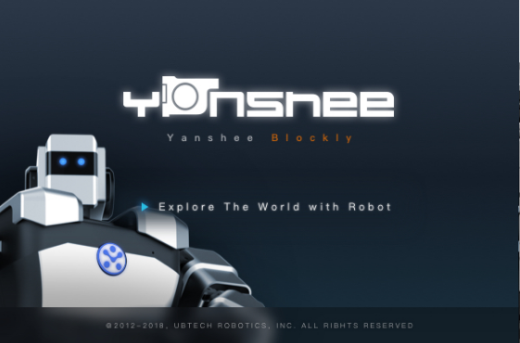

打开界面：       

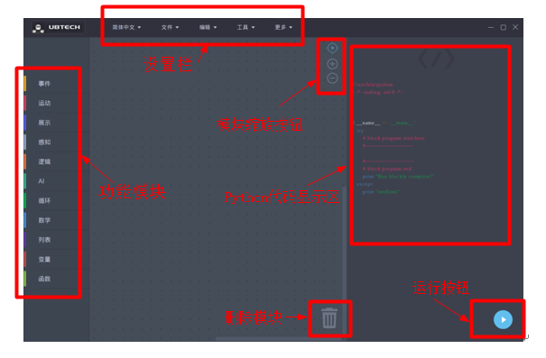
 
其中，最左侧是功能模块，用来组装各种逻辑模块来完成blockly编程。最上方一排是设置栏包括了语言、文件、编辑、工具、更多等。最右侧是Python代码显示区，当我们拖动一个模块到左侧的代码编辑区，相应的右侧就会显示Python源代码。右下角是运行按钮，当我们编辑好一个逻辑程序之后，点击运行按钮就可以看到运行效果。下面是具体模块功能详细说明：

## 设置栏：

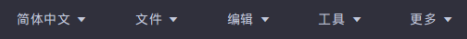
 
## 语言设置：可以实现中英文模块切换显示。

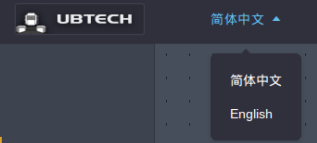

## 文件操作： 

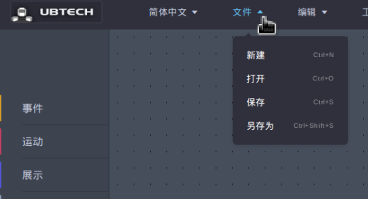

可以新建文件、打开上次保存的文件、保存当前文件、另存当前文件等功能。

## 编辑：在编程过程中，可以对当前组建的模块进行撤销和恢复操作。

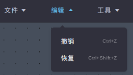
 
## 工具：包括连接机器人默认连接本机，传感器读数窗口可以显示当前机器人需要读出的传感器数据。

 
## 更多：

包括版本：显示了当前blockly使用版本号，反馈是您可以给我们发邮件告诉我们您的使用体验和意见建议等。

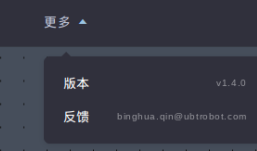
 
## 组件功能模块介绍：

组件功能模块包括：事件、运动、展示、感知、逻辑、AI、循环、数学、列表、变量、函数。右侧的例子我们用逻辑、AI、运动、展示模块来完成我们需要的一个简单的人脸识别的blockly模块编程。

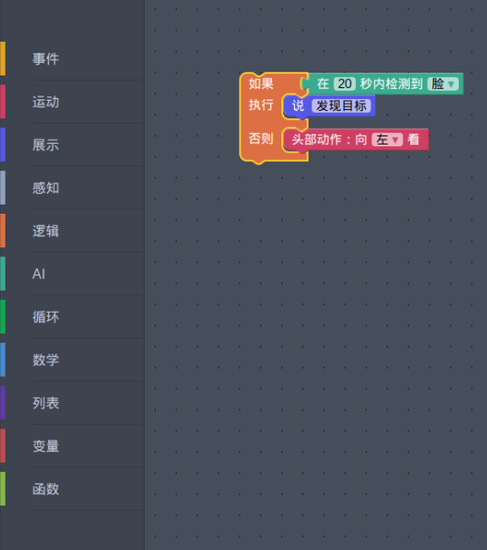
 

## 事件：
 
包括：触摸传感器ID 左边、右边全部被触摸事件检测，摄像头颜色检测两个功能block块。

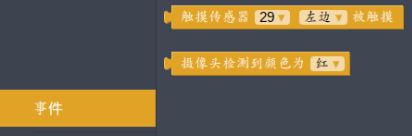

## 运动：
 
包括：特殊动作、手部动作、腿部动作、格斗动作、行走、头部动作、机器人拍照、舵机设置等机器人内置动作block模块。

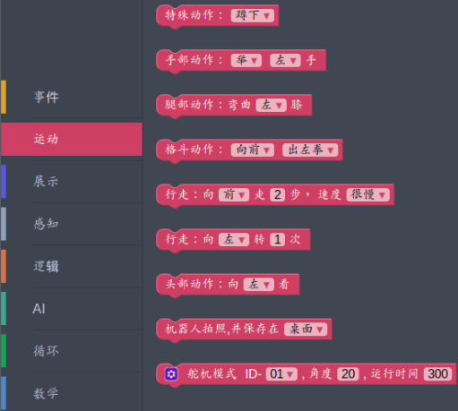

## 展示：
 
包括：机器人TTS功能、交通声、胸前按钮灯颜色设置等。用来完成机器人说话、模拟声音、显示灯效等编程场景。

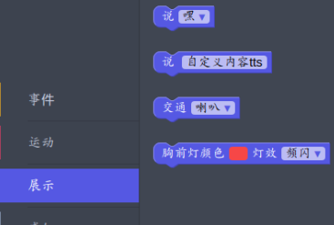

## 感知：

传感器相关显示模块。包括了超声波、红外、温湿度、压力等传感器数据检测模块用来完成各种障碍物检测或温湿度压力数据需求场合编程。

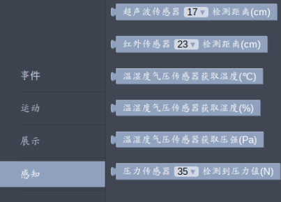
 
## 逻辑：

我们在编程中通常需要作出判断、延时、关系等逻辑实现，这个模块就是完成了这些功能。

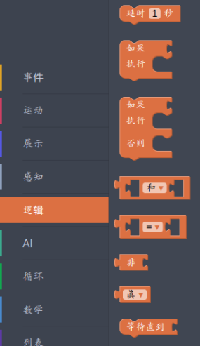
 
## AI模块：

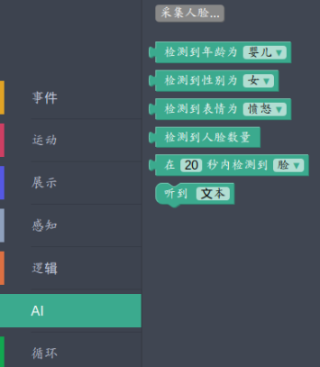

 
## 采集人脸：

这个是我们的人脸录入功能当我们点击这个模块时候，要求拍照并给自己的人脸库输入名称、可以录入多张人脸完成采集人脸库的过程。之后会在最下面生成一个人脸库模块如下红色框图所示：这个模块代表我们在20秒之内是否识别到刚刚录入的人，如果有就做相应的动作，直接拖出来用即可。

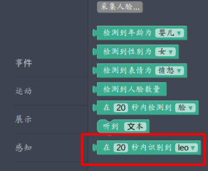
 
## 检测到年龄为：

婴儿、少年、青年、中年、老年五个年龄段的数据标签。

## 检测到性别为：

男、女。

## 检测到表情：

高兴、愤怒、惊讶、平静、悲伤、厌恶、恐惧等七种表情。

## 检测到人脸数量：

用来统计多少个数量的人脸，做出相应的场景设计。

## 听到文本：

让机器人检测是否听到某些关键词，做相应的动作。

## 循环：

在编程过程中，我们需要重复做很多事情，这个功能就用这个模块来完成循环的功能。

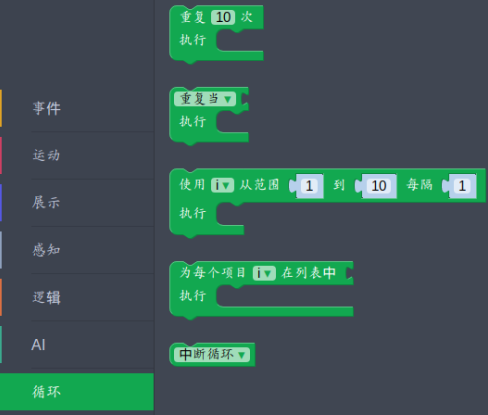
 
## 数学：

与动作相关的函数，用来方便我们编程、例如平方根、余数、正弦函数等从这里来拿到相应的数值，完成相应的程序编写。
 
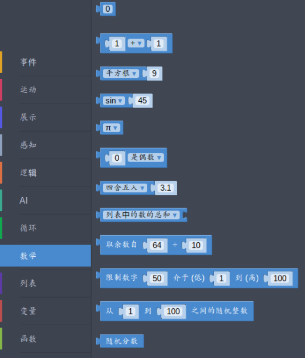

## 列表：

这个模块用来大型化编程，便于我们处理一组数据，完成排序等功能、筛选等功能设计。

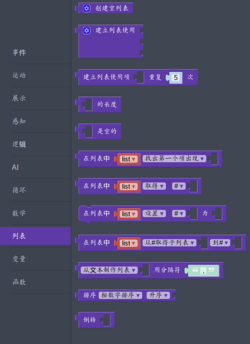
 

## 变量：

通过创建一个变量，来完成相应的数学编程。我们点击创建变量之后，创建了一个a变量，发现会出现后面三个block模块。

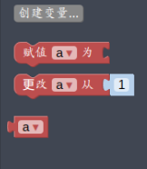
 
## 函数：

通常函数用来完成需要我们重复做的事情，然后返回相应的函数处理结果。这个模块就编写函数的block块。

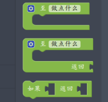

 
## 环境准备：

硬件需求：Yanshee机器人一台（安装blockly）

软件需求：树莓派Rasbian系统、python环境

## 工作原理：

通过blockly模块化编程，来实现应用场景使用设计，内部模块通过python脚本的格式调用RobotApi库函数，完成舵机、动作、传感、语音、视觉等五大功能的综合性应用。而SDK与内部机器人功能模块之间是通过UDP方式完成通信的。

## 实践项目：通过Blockly编程实现人脸识别应用场景体验

基础实验：传感器障碍物读取。完成机器人障碍物检测，并实时播报障碍物信息，同时改变胸前灯颜色来发出警示。

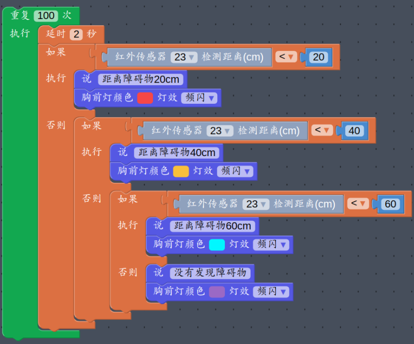

 
## 高级实验：

通过Blockly编程实现人脸识别应用场景体验。

其中我们用到了人脸个数、人脸识别、性别识别、TTS、动作、触摸传感等多个功能模块的综合实验课。

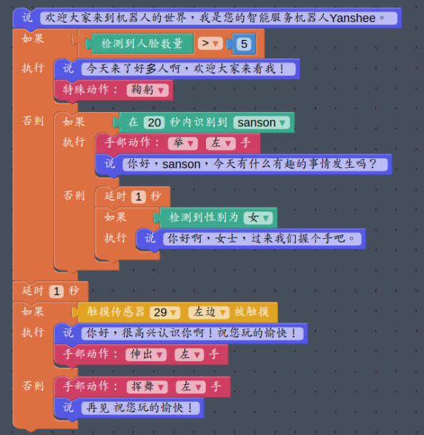
 
## 应用场景：

积木类机器人、STEAM类机器人教育、Yanshee机器人等等市面上大多数机器人都支持模块化编程。大家通过各种blockly编程块实现了各种应用场景的编程。让一个活生生的人工智能机器人来为人类生产生活服务吧。

## 拓展阅读：
Blockly模块化编程便于我们通过python编程结合机器人各种功能完成我们需要的应用场景设计。而我们最终目的是通过这些有趣的编程实现我们生活中对机器人实用性需求。比如今天我们学会了基础的让机器人躲避障碍物并提示我们自己已经处于安全地位，明天我们可以通过编程实现机器人迅速救援火灾受伤人员，然后通知我们已经顺利完成救援工作。

 
 

