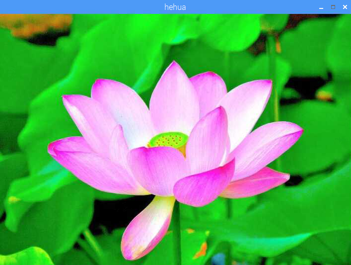
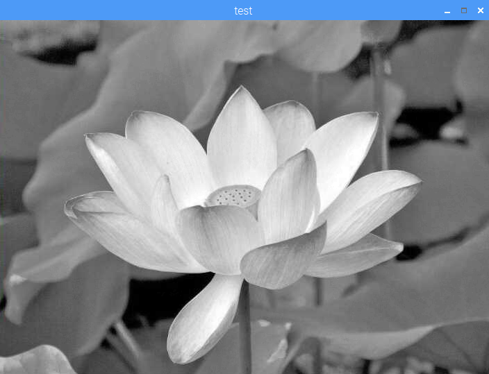
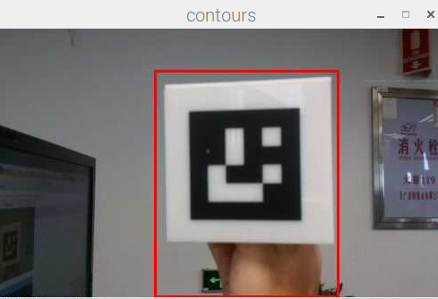
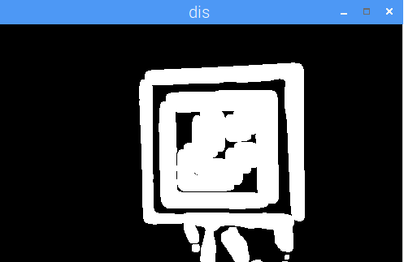

# OpenCV开源视觉库使用介绍
## 课程目标

&emsp;&emsp;通过对视觉基础开源库OpenCV的介绍，我们将学会如何使用最基本的视觉库来完成各种有趣而重要的视觉开发任务和图像处理任务。OpenCV支持多种开发语言接口，我们主要用到了C++和Python接口，最后通过Python的案例来认识这个强大的开源视觉工具库。

## 课程引入原因
&emsp;&emsp;计算机视觉是当前人工智能研究的一种重要方向，而图像处理技术是这一方向的基础性学科。而Opencv就是这样一个专门为处理图像而生的开源视觉库。OpenCV于1999年由Intel建立，如今由Willow Garage提供支持。OpenCV是一个基于BSD许可 （开源）发行的跨平台计算机视觉库。有了OpenCV之后，我们对图像和视频流的处理就变得十分得心应手了。由于机器学习中数据预处理、数据读取、分类器训练、数据模型应用与部署等关键步骤里都会用到OpenCV的库函数来处理。后续我们会经过不断的练习和分析学会这项基本技能。为打开机器学习的大门奠定坚实的基础。
## 基础概念与知识点介绍：
**图像处理：**（Image Processing）是用计算机对图像进行分析，以达到所需结果的技术。图像处理技术一般包括图像压缩，增强和复原，匹配、描述和识别3个部分。数字图像处理（Digital Image Processing）是通过计算机对图像进行去除噪声、增强、复原、分割、提取特征等处理的方法和技术。  

**OpenCV：** 全称Open source Computer Vision Library,开放源代码计算机视觉库。也就是说，它是一套关于计算机视觉的开放源代码的API函数库。OpenCV是一个跨平台计算机视觉库，可以运行在Linux、Windows、Android和Mac OS操作系统上。它轻量级而且高效，由一系列 C 函数和少量 C++ 类构成，同时提供了Python、Ruby、MATLAB等语言的接口，实现了图像处理和计算机视觉方面的很多通用算法。包括的主要模块如下：  

&emsp;&emsp;1、opencv_core ： 核心功能模块，包括：基本结构、算法、线性代数、离散傅里叶变换、XML和YML文件IO操作等  
&emsp;&emsp;2、opencv_imgpro：图像处理模块，包括：滤波、高斯模糊、形态学处理、几何变换、颜色空间转换及直方图等  
&emsp;&emsp;3、opencv_ml：机器学习模块，包括：支持向量机、决策树、boosting方法等  
&emsp;&emsp;4、opencv_objdetect：目标检测模块，包括：人脸检测、水杯、车辆等特定物体检测。  
&emsp;&emsp;5、opencv_video：视频模块，包括：光流法、背景减除、目标跟踪等  

&emsp;&emsp;主要应用领域如下：  
&emsp;&emsp;包括人机互动 、物体识别 、图像分割 、人脸识别  、运动跟踪 、机器视觉 、结构分析 、工业产品检测、医学成像、无人机飞行、无人驾驶、安防、 卫星地图与电子地图拼接、信息安全、用户界面、摄像机标定、立体视觉和机器人等计算机视觉应用领域。
  
&emsp;&emsp;主要功能包括：  
&emsp;&emsp;1、图像数据的操作 ( 分配、释放、复制、设置和转换)。 图像是视频的输入输出I/O （文件与摄像头的输入、图像和视频文件输出）。   
&emsp;&emsp;2、矩阵和向量的操作以及线性代数的算法程序（矩阵积、解方程、特征值以及奇异值等）。   
&emsp;&emsp;3、各种动态数据结构（列表、队列、集合、树、图等）。   
&emsp;&emsp;基本的数字图像处理（滤波、边缘检测、角点检测、采样与差值、色彩转换、形态操作、直方图、图像金字塔等）。   
&emsp;&emsp;4、结构分析（连接部件、轮廓处理、距离变换、各自距计算、模板匹配、Hough变换、多边形逼近、直线拟合、椭圆拟合、Delaunay 三角划分等）。   
&emsp;&emsp;5、摄像头定标（发现与跟踪定标模式、定标、基本矩阵估计、齐次矩阵估计、立体对应）。   
&emsp;&emsp;6、运动分析（光流、运动分割、跟踪）。   
&emsp;&emsp;7、目标识别（特征法、隐马尔可夫模型：HMM）。   
&emsp;&emsp;8、基本的GUI （图像与视频显示、键盘和鼠标事件处理、滚动条）  

## 环境准备
&emsp;&emsp;Yanshee机器人一台 、Rasbian系统。

## 工作原理

&emsp;&emsp;通过OpenCV开源视觉库，对图像和视频做一些基本实验案例，完成学习该视觉工具库的目的。

## 实践项目

### 实验1、基础灰度图处理实验。
&emsp;&emsp;机器人身上新建opencv_test文件夹，下面建立gray.py 并放一张彩色图片hehua.png  
&emsp;&emsp;其中gray.py文件内容如下：

    import cv2
    
    img = cv2.imread("hehua.png")  
    gray = cv2.cvtColor(img, cv2.COLOR_BGR2GRAY)
    cv2.imshow('hehua', img)
    cv2.imshow('test', gray)
    cv2.imwrite('gray.jpg',gray)
    c = cv2.waitKey(0)
    cv2.destroyAllWindows()
    
&emsp;&emsp;我们打开命令窗口，输入以下命令：
        
        cd Desktop/opencv_test
        python gray.py

&emsp;&emsp;运行结果如下：  
             

&emsp;&emsp;可以看到我们实现了一个基本的灰度图实验。右边是左边图像的灰度图，我们也可以自己修改图片的名称和自己需要处理的图片来做实验体验一下。  
### 实验二，通过opencv检测运动物体，并通过差分图表示出来。
&emsp;&emsp;motion_track.py内容如下：
        #!/usr/bin/python
        # -*- coding: utf-8 -*- 
        
        from picamera.array import PiRGBArray
        from picamera import PiCamera
        from functools import partial
        
        from socket import *
        import multiprocessing as mp
        import cv2
        import os
        import time
        import httplib, urllib, base64, json
        import threading
        
        resX = 500
        resY = 300
        
        avg = None
        es = cv2.getStructuringElement(cv2.MORPH_ELLIPSE, (9, 4))
        
        # 启动并预热摄像头
        camera = PiCamera()
        camera.resolution = (resX, resY)
        camera.framerate = 30
        
        # 转换输出格式
        rawCapture = PiRGBArray(camera, size=(resX, resY))
        time.sleep(5)
        rawCapture.truncate(0)
        
        for f in camera.capture_continuous(rawCapture, format="bgr", use_video_port=True):
            frame = f.array
        
            # 调整帧尺寸，转换为灰阶图像并进行模糊
            #frame = cv2.resize(frame, width=500)
            gray = cv2.cvtColor(frame, cv2.COLOR_BGR2GRAY)
            gray = cv2.GaussianBlur(gray, (21, 21), 0)
        
            # 如果平均帧是None，初始化它
            if avg is None:
                print "[INFO] starting background model..."
                avg = gray.copy().astype("float")
                rawCapture.truncate(0)
                continue
        
            cv2.accumulateWeighted(gray, avg, 0.5)
            # 对于每个从背景之后读取的帧都会计算其与背景之间的差异，并得到一个差分图（different map）。  
            # 还需要应用阈值来得到一幅黑白图像，并通过下面代码来膨胀（dilate）图像，从而对孔（hole）和缺陷（imperfection）进行归一化处理  
            diff = cv2.absdiff(gray, cv2.convertScaleAbs(avg))  
        
            diff = cv2.threshold(diff, 5, 255, cv2.THRESH_BINARY)[1] # 二值化阈值处理  
            diff = cv2.dilate(diff, None, iterations=2) # 形态学膨胀  
            # 显示矩形框
            (contours, _) = cv2.findContours(diff.copy(), cv2.RETR_EXTERNAL, cv2.CHAIN_APPROX_SIMPLE) # 该函数计算一幅图像中目标的轮廓  
            for c in contours:  
                if cv2.contourArea(c) < 5000: # 对于矩形区域，只显示大于给定阈值的轮廓，所以一些微小的变化不会显示。  
                    continue  
                (x, y, w, h) = cv2.boundingRect(c) # 该函数计算矩形的边界框  
                cv2.rectangle(frame, (x, y), (x+w, y+h), (0, 0, 255), 2)
                print"x=%d y=%d w=%d h=%d " %(x,y,w,h)
          
            cv2.imshow('contours', frame)  
            cv2.imshow('dis', diff)
            
            key = cv2.waitKey(1) & 0xFF  
            # 按'q'健退出循环  
            if key == ord('q'):  
                break	
            rawCapture.truncate(0)
            
        # 释放摄像头资源 
        camera.release()
        cv2.destroyAllWindows()

&emsp;&emsp;打开命令行，输入如下命令：

        python motion_track.py

&emsp;&emsp;运行结果如下：
 
 
 
   
&emsp;&emsp;其中，x、y、w、h分别表示运动物体被方框框出来的左上角坐标值和方框的宽高值。我们可以看到，opencv通过对视频流中的两幅连续帧之间的差值来计算是否有物体在运动，进而用红色的矩形框标出运动的物体的位置，并用黑白差分图来表示出运动部分。这个案例显示了一个基本的opencv的使用示例。

## 小结与拓展
&emsp;&emsp;通过本节课的学习，我们学到了图像处理工具opencv的基本使用方法。其实从前面的人脸检测到基于PCA降维算法的人脸识别、再到后面的机器人颜色识别项目，我们都是通过opencv视觉库来完成的。而且很多深度学习和机器学习的数据处理部分，都用到了相应的opencv函数接口。目前最新版的opencv是4.1版。而新版的opencv集成了机器学习等多种有用的模型和方法，供使用人员直接调用。总之，在机器视觉领域，它的应用非常广泛，已经成为了我们现实生活中不可或缺的一个必需工具。

### 参考教程：  
[https://opencv.org/](https://opencv.org/)

