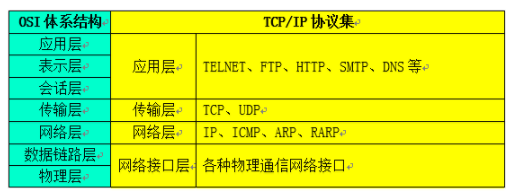

# 机器人集控与通信控制
  
## 课程目标

&emsp;&emsp;通过本课程来理解什么是机器人的基本通信？我们为什么需要通信网络来为机器人完成各种信息传输？互联网设备与机器人，机器人之间都是如何通信的？这些都是我们这节课的重点。通过本节课的学习，可以让我们学到网络通讯这一重要工具是如何在机器人身上应用的。
## 课程引入原因
&emsp;&emsp;自人类诞生以来，就从未停止过对信息传递效果的追求。在古代，人类通过驿站、飞鸽传书、烽火报警、符号、身体语言、眼神、触碰等方式进行信息传递。从语言的出现、到文字的使用再到后来随着现代科学水平的发展，相继出现的无线电磁波、固定电话、移动电话、互联网甚至视频电话等各种通信方式。通信技术拉近了人与人之间的距离，提高了经济的效率，改变了人类的生活方式和社会面貌。如今我们生活在一个互联网时代，E-Mail、微信、移动5G等新技术的发展、不停的更新着信息传递的速率与时效。物联网智能家居、各种人工智能设备都围绕在我们身旁。在万物互联的网络里，每一个设备都可以抽象成一个节点，他们之间通过网络协议连接来互动完成人类希望他们完成的任务，而我们机器人本身就是一种智能设备，为了让它与人类能更好的互动，把机器人加到我们的网络里来实现相应的功能就是一件必要的事情。事实上我们通过无线通信技术与机器人连接、让机器人完成许多人机交互、物物交互的重要任务，从而为人类的生产生活带来了非常深刻的变革。然而这一切对我们来说是一件极其有趣而富有挑战的事情。

## 基础概念及知识点介绍

**通信：** 指人与人或人与自然之间通过某种行为或媒介进行的信息交流与传递，从广义上指需要信息的双方或多方在不违背各自意愿的情况下采用任意方法，任意媒质，将信息从某方准确安全地传送到另一方。  

**网络：** 网络是由节点和连线构成，表示诸多对象及其相互联系。在数学上，网络是一种图，一般认为专指加权图。网络除了数学定义外，还有具体的物理含义，即网络是从某种相同类型的实际问题中抽象出来的模型。在计算机领域中，网络是信息传输、接收、共享的虚拟平台，通过它把各个点、面、体的信息联系到一起，从而实现这些资源的共享。网络是人类发展史来最重要的发明，提高了科技和人类社会的发展。 

**协议：** 人在说话时，通过声带振动、口型的变化发出不同的声音。这些声音按照一定的规则，承载了我们所要表达的思想和信息，这套规则称为语言。两个人对话，需要使用两个人都能理解的语言进行，一个只懂中文和另一个只懂英文的人，根本没法用语言交流（当然可以用其他方式，比如面部表情、肢体语言等）。同样，智能设备通信时，也要有这样一套双方都遵从的规定，而这个规定被称为协议。通信协议和接口都可以有多种，并且两者之间存在一定的关联。  
  
**网络通信：** 网络通信是通过网络将各个孤立的设备进行连接，通过信息交换实现人与人，人与计算机，计算机与计算机之间的通信。网络通信，主要包括数据通信、网络连接以及协议三个方面的内容。  
 
**网络通信协议：** 通俗地说，网络协议就是网络之间沟通、交流的桥梁，只有相同网络协议的计算机才能进行信息的沟通与交流。这就好比人与人之间交流所使用的各种语言一样，只有使用相同语言才能正常、顺利地进行交流。从专业角度定义，网络协议是计算机在网络中实现通信时必须遵守的约定，也就是通信协议。主要是对信息传输的速率、传输代码、代码结构、传输控制步骤、出错控制等作出规定并制定出标准。网络通信协议是一种网络通用语言，为连接不同操作系统和不同硬件体系结构的互联网络引提供通信支持，是一种网络通用语言。常见的网络通信协议有：TCP/IP协议、IPX/SPX协议、NetBEUI协议等。  

**互联网：** 又称网际网络，或音译因特网(Internet)、英特网，互联网始于1969年美国的阿帕网。是网络与网络之间所串连成的庞大网络，这些网络以一组通用的协议相连，形成逻辑上的单一巨大国际网络。这种将计算机网络互相联接在一起的方法可称作“网络互联”，在这基础上发展出覆盖全世界的全球性互联网络称互联网，即是互相连接一起的网络结构。在这个网络中有交换机、路由器等网络设备、各种不同的连接链路、种类繁多的服务器和数不尽的计算机、终端。使用互联网可以将信息瞬间发送到千里之外的人手中，它是信息社会的基础。Internet上的计算机使用的是TCP/IP协议。  

**计算机通信网络：** 计算机网络通信技术是通信技术与计算机技术相结合的产物。计算机网络是按照网络协议，将地球上分散的、独立的计算机相互连接的集合。连接介质可以是电缆、双绞线、光纤、微波、载波或通信卫星。计算机网络具有共享硬件、软件和数据资源的功能，具有对共享数据资源集中处理及管理和维护的能力。计算机网络通常被分为：局域网（LAN）、城域网（MAN）、广域网（WAN）  

**移动网络通信：** 移动通信是移动体之间的通信，或移动体与固定体之间的通信。移动体可以是人，也可以是汽车、火车、轮船、收音机等在移动状态中的物体。移动通信系统从20世纪80年代诞生以来，到2020年将大体经过5代（5G通信）的发展历程，2010年，已经从第3代过渡到第4代即4G。除蜂窝电话系统外，宽带无线接入系统、毫米波LAN、智能传输系统(ITS)和同温层平台(HAPS)系统将投入使用。未来几代移动通信系统最明显的趋势是要求高数据速率（传输的数据由开始的短信消息到各种多媒体信息并发处理）、高机动性和无缝隙漫游。通信双方有一方或两方处于运动中的通信。包括陆、海、空移动通信。采用的频段遍及低频、中频、高频、甚高频和特高频。移动通信系统由移动台、基台、移动交换局组成。  

**TCP/IP分层协议：** Transmission Control Protocol/Internet Protocol的简写，中译名为传输控制协议/因特网互联协议，又名网络通讯协议，是Internet最基本的协议、Internet国际互联网络的基础，由网络层的IP协议和传输层的TCP协议组成。TCP/IP 定义了电子设备如何连入因特网，以及数据如何在它们之间传输的标准。协议采用了4层的层级结构，每一层都呼叫它的下一层所提供的协议来完成自己的需求。通俗而言：TCP负责发现传输的问题，一有问题就发出信号，要求重新传输，直到所有数据安全正确地传输到目的地。而IP是给因特网的每一台联网设备规定一个地址。  
 
   

**物联网：** 物联网是新一代信息技术的重要组成部分，也是“信息化”时代的重要发展阶段。其英文名称是：“Internet of things（IoT）”。顾名思义，物联网就是物物相连的互联网。这有两层意思：其一，物联网的核心和基础仍然是互联网，是在互联网基础上的延伸和扩展的网络；其二，其用户端延伸和扩展到了任何物品与物品之间，进行信息交换和通信，也就是物物相息。物联网通过智能感知、识别技术与普适计算等通信感知技术，广泛应用于网络的融合中，也因此被称为继计算机、互联网之后世界信息产业发展的第三次浪潮。在物联网应用中有三项关键技术：传感器技术、RFID标签、嵌入式系统技术等。  

**无线通信技术：** 无线通信主要包括微波通信和卫星通信。微波是一种无线电波，它传送的距离一般只有几十千米。但微波的频带很宽，通信容量很大。微波通信每隔几十千米要建一个微波中继站。卫星通信是利用通信卫星作为中继站在地面上两个或多个地球站之间或移动体之间建立微波通信联系。包括：蓝牙、红外、NFC、RFID、WIFI。其中IEEE 802.11标准是IEEE制定的无线局域网标准，主要是对网络的物理层(PH)和媒质访问控制层(MAC)进行了规定，其中对MAC层的规定是重点。  

**蓝牙：** （ Bluetooth）：是一种无线技术标准，可实现固定设备、移动设备和楼宇个人域网之间的短距离数据交换。蓝牙的波段为2400–2483.5MHz（包括防护频带）。这是全球范围内无需取得执照（但并非无管制的）的工业、科学和医疗用（ISM）波段的 2.4 GHz 短距离无线电频段。  

**WIFI：** 是一种允许电子设备连接到一个无线局域网（WLAN）的技术，通常使用2.4G UHF或5G SHF ISM 射频频段。连接到无线局域网通常是有密码保护的；但也可是开放的，这样就允许任何在WLAN范围内的设备可以连接上。Wi-Fi是一个无线网络通信技术的品牌，由Wi-Fi联盟所持有。目的是改善基于IEEE 802.11标准的无线网路产品之间的互通性。有人把使用IEEE 802.11系列协议的局域网就称为无线保真。甚至把Wi-Fi等同于无线网际网路（Wi-Fi是WLAN的重要组成部分）。  

**硬件通信接口协议：** 机器人内部或者硬件设备模块之间通常会经过特定的通信接口来完成内部数据通信，原理上都是采用获取数字高低电平和时序的原则来完成各种接口通信，常用的硬件接口包括： GPIO接口协议、UART串口接口协议、SPI接口协议、IIC接口协议等等。  

**机器人ROS通信：** ROS（Robot Operating System，下文简称“ROS”）是一个适用于机器人的开源的元操作系统。它提供了操作系统应有的服务，包括硬件抽象，底层设备控制，常用函数的实现，进程间消息传递，以及包管理。它也提供用于获取、编译、编写、和跨计算机运行代码所需的工具和库函数。ROS的核心是节点（node）。节点是一小段用Python或C++写成的程序，用来执行某个相对简单的任务或进程。多个节点之间互相传递信息（message），并可以独立控制启动或终止。某一节点可以面向其它节点针对特定标题（topic）发布信息或提供服务（service）。目前我们Yanshee机器人已经全面支持ROS系统，包括ROS订阅消息和service两种通信方式。  

&emsp;&emsp;具体可查阅：附录Yanshee_ROS消息汇总。  

&emsp;&emsp;参考ROS官网：[http://www.ros.org/](http://www.ros.org/)  

&emsp;&emsp;ROS WiKi 地址：[http://wiki.ros.org/](http://wiki.ros.org/)

## 环境准备

### 硬件：

&emsp;&emsp;Yanshee机器人一台（Yanshee内部的树莓派本身集成了蓝牙和WIFI模块）

### 软件：

&emsp;&emsp;Debian系统、python环境、Ros系统环境

## 工作原理：

### Yanshee内部的通讯原理：

&emsp;&emsp;Yanshee内部通过IIC硬件接口协议将STM32和树莓派连接实现了两个嵌入式系统的数据传输，而STM32与传感器也通过IIC连接实现了数据读取。

### Yanshee在网络通信中的位置：

&emsp;&emsp;手机通过蓝牙和WIFI技术与Yanshee连接之后再通过TCP/UDP传输协议传输数据来控制Yanshee行为活动。一台Yanshee通过局域网内的UDP协议来控制另一台Yanshee、Yanshee自己也可以通过WIFI或蓝牙来控制其它智能家居设备。总之，Yanshee是通信网中的一个节点，一个可以控制和被控制也可以组织其它机器人一起协作的高级智能机器人。  

### 实践项目

#### 基础实验：通过UDP通信来控制Yanshee的一个舵机转动。

    #!/usr/bin/python
    #coding=utf-8
    
    from socket import *
    
    def headangle(angle, ADDR):
        data = str("{\"cmd\":\"servo\",\"type\":\"write\",\"time\":35,\"angle\":\"FFFFFFFFFFFFFFFFFFFFFFFFFFFFFFFF")
        angle_hex = str(hex(angle))
        print"angel_hex = %s" %(angle_hex)
        end = str("\"}")
    
        if(angle<16):
            hexdate=(data+"0"+angle_hex[-1]+end)
            udpCliSock.sendto(hexdate ,ADDR)
            print(hexdate)
        else:
            udpCliSock.sendto(data + angle_hex[2] + angle_hex[3] + end ,ADDR)
            print(data + angle_hex[2] + angle_hex[3] + end)
            
    if __name__ == '__main__':
        print("Test UDP communication start.")
        HOST = '127.0.0.1'
        PORT = 20001
        ADDR = (HOST, PORT)
        udpCliSock = socket(AF_INET, SOCK_DGRAM)
        headangle(60, ADDR)
        print("Test UDP communication end.")
        
&emsp;&emsp;代码流程解读：通过UDP通信我们完成了一个简单的控制头部舵机转动的过程。  

#### 高级实验、集控：同时控制多个Yanshee机器人跳舞。
&emsp;&emsp;操作步骤说明：  

&emsp;&emsp; 1、将所有机器人连到同一个局域网（wifi热点）内。  

&emsp;&emsp; 2、用vnc或其他ssh工具登录到一个机器人上、或者用hdmi线连接机器人。（可先使用手机app查看机器人IP地址）  

&emsp;&emsp; 3、将sc.py文件拷贝到该机器人桌面上。（或任意目录下）  

&emsp;&emsp; 4、测试所有机器人做stop动作。  

&emsp;&emsp;&emsp;&emsp;# python sc.py stop  

&emsp;&emsp; 5、机器人一起跳舞。  

&emsp;&emsp;&emsp;&emsp;a、跳一遍wakawaka:  

&emsp;&emsp;&emsp;&emsp;# python sc.py Waka_Waka  

&emsp;&emsp;&emsp;&emsp;b、跳四遍wakawaka：  

&emsp;&emsp;&emsp;&emsp;# python sc.py wakawakax4  

&emsp;&emsp;Sc.py文件内容如下：  

    # -*- coding: utf-8 -*-
    import sys
    import time
    from socket import *
    
    def sendmsg(ip,buf):
        PORT = 20005
        ADDR = (ip, PORT)
        udpclientSock = socket(AF_INET, SOCK_DGRAM)
        udpclientSock.setsockopt(SOL_SOCKET, SO_BROADCAST, 1)
        udpclientSock.sendto(buf, ADDR)
        udpclientSock.close()
    
    def action_func(Name,Repeat):
        print 'action name: ', Name,'.hts'
        print 'repeat times: ',Repeat
        send_string = "{\"cmd\":\"action\",\"type\":\"start\", \"para\":{\"name\":\""
        send_string = send_string + Name
        send_string = send_string + "\",\"repeat\":" + str(Repeat) + "}}"
        print send_string
        sendmsg("255.255.255.255", send_string)
        
    if __name__ == '__main__':
        print 'start play action process'
        default_port = 20006
        if len(sys.argv) == 2:
            action_name = sys.argv[1]
            action_func(action_name, 1)
        elif len(sys.argv) == 3:
            action_name = sys.argv[1]
            repeat = int(sys.argv[2],10)
            action_func(action_name, repeat)
        else:
            print '输入参数错误!'
            print '正确格式: python action_test.py  名称 '
            
            
&emsp;&emsp;我们通过广播形式的UDP报文来对同一局域网内的机器人控制做stop动作或者跳wakawaka舞蹈。

## 小结与拓展
&emsp;&emsp; 通过这一课的学习，我们已经具备了基本的网络通信的使用方法，以后我们会逐渐的学会为了达到设备与设备之间的通信，只要我们了解了他们之间的通信方式和通信协议知道他们支持的通信接口，就能为陌生的两个设备之间建立连接，从而实现联网互动的功能。随着WiFi、蓝牙、2.4G、5G、RFID、UWB、ZigBee、NB—IOT、AllJoin协议等无线物联网协议的层出不穷，深度学习、人工智能技术的不断发展让我们的网络世界变得越来越多样化、智能化和高效化。而设备之间如何高效而节能的自组织通信是我们研究的重点和难点。
