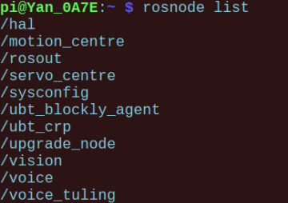

# 标准ROS与机器人基本通信
## 课程目标
&emsp;&emsp;通过本课程我们会学习什么是ROS系统，为什么很多机器人需要一个ROS系统？我们还会学到ROS的基本理论与基础操作方法。然后我们会介绍Yanshee机器人内部包含的ROS节点结构信息。最后我们通过一些例子来说明如何与Yanshee进行ROS通信并实现相应的控制效果。

## 课程引入原因
&emsp;&emsp;随着机器人技术的不断发展、各种软硬件层出不穷，而机器人的硬件接口不统一软件层次不同导致的开发和维护成本越来越高，极大的阻碍了机器人行业的发展。由于不同机器人企业的控制系统都不同，对于终端应用企业来说，维护和重新编程很不方便，有些交互界面还非常不友好，极大地降低了效率。在这样的背景下，如何做出一个适用于各种机器人的控制软件则显得尤为重要，而ROS系统用统一的方式封装机器人的特点很好的迎合了这一需求，普通用户只需要在ROS中编写应用程序即可，不需要关心机器人底层的控制方式。 基于ROS的开源库去编程的控制软件原则上对于机器人的普及将会起到重要作用。ROS还是一款分布式操作系统，分布式结构的好处在于在多个设备上使用ROS，完全就像在一个设备上一样。 ROS系统分布式的特点也培养了用户共享软件包的大型社区，它使得开发者在ROS核心系统基础上，增添许多新功能。ROS的还具有模块化特点，可以轻松的替换各种传感器和执行机构，替换软件中的各个算法，使得搭建机器人就像玩乐高积木和组装一台电脑一样。ROS是国际上比较通用的一种机器人操作系统。更方便的让会使用ROS规则的开发者们，能够快速实现与机器人之间的通信。于是学习如何使用ROS也变得比较重要了。  

## 基础概念及知识点介绍

**ROS：** （Robot Operating System）是用于机器人的一种后操作系统，或者说次级操作系统。它提供了类似操作系统应有的服务，包括硬件抽象，底层设备控制，常用函数的实现，进程间消息传递，以及包管理。它也提供用于获取、编译、编写、和跨计算机运行代码所需的工具和库函数。ROS是基于一种图状架构，从而不同节点的进程能接受，发布，聚合各种信息（例如传感，控制，状态，规划等等）。目前ROS已广泛应用于Clearpath物流机器人、Fetch导购机器人、Erle无人机、DJI大疆无人机、DataSpeed自动驾驶汽车、Nao舞蹈机器人、Lego玩具机器人、iRobot扫地机器人、Pepper情感机器人等多种机器人身上。ROS维基官网：http://wiki.ros.org/  

**ROS的安装：** ROS有多个发行版本，目前最流行的是两个版本：Indigo和Kinect。主要支持Linux类系统。可以通过这个链接学习如何安装ROS-Kinect到树莓派debian系统上。[http://wiki.ros.org/ROSberryPi/Installing%20ROS%20Kinetic%20on%20the%20Raspberry%20Pi](http://wiki.ros.org/ROSberryPi/Installing%20ROS%20Kinetic%20on%20the%20Raspberry%20Pi)  

**ROS程序包：**（package）是代码组织的基本文件包，里面一般包含一个CmakeLists.txt文件和一个package.xml文件，还有就是src(cpp)或scripts(python)源文件夹。通常一个ROS程序包里包含一个ROS节点。  

**ROS工作空间：** 是一个专门组织ROS程序包的代码集合。可以通过catkin的方式生成。命令如下：  

    $ mkdir -p ~/catkin_ws/src
    $ cd ~/catkin_ws/src
    
&emsp;&emsp;即使这个工作空间是空的（在'src'目录中没有任何软件包，只有一个CMakeLists.txt链接文件），你依然可以编译它：  

    $ cd ~/catkin_ws/
    $ catkin_make
&emsp;&emsp;catkin_make命令在catkin 工作空间中是一个非常方便的工具。如果你查看一下当前目录应该能看到'build'和'devel'这两个文件夹。在'devel'文件夹里面你可以看到几个setup.*sh文件。source这些文件中的任何一个都可以将当前工作空间设置在ROS工作环境的最顶层。接下来首先source一下新生成的setup.*sh文件：  

    $ source devel/setup.bash
    
**ROS节点：** ROS的核心是节点（node）。节点是一小段用Python或C++写成的程序，用来执行某个相对简单的任务或进程。多个节点之间互相传递信息（message），并可以独立控制启动或终止。某一节点可以面向其它节点针对特定标题（topic）发布信息或提供服务（service）。一个节点其实只不过是ROS程序包中的一个可执行文件。  

**ROS消息：** Messages: 消息，消息是一种ROS数据类型，用于订阅或发布到一个话题。一个发布者的消息可以被多个订阅者订阅。  

&emsp;&emsp;基本的消息发布者和订阅者举例：  

&emsp;&emsp;python代码如下：

&emsp;&emsp;发布者（Publisher）：
    
    #!/usr/bin/env python
    # license removed for brevity
    import rospy
    from std_msgs.msg import String
    
    def talker():
       pub = rospy.Publisher('chatter', String, queue_size=10)
       rospy.init_node('talker', anonymous=True)
       rate = rospy.Rate(10) # 10hz
       while not rospy.is_shutdown():
           hello_str = "hello world %s" % rospy.get_time()
           rospy.loginfo(hello_str)
           pub.publish(hello_str)
           rate.sleep()
    
    if __name__ == '__main__':
       try:
           talker()
       except rospy.ROSInterruptException:
           pass

&emsp;&emsp;订阅者（Subscriber）：

    #!/usr/bin/env python
    import rospy
    from std_msgs.msg import String
    
    def callback(data):
       rospy.loginfo(rospy.get_caller_id() + "I heard %s", data.data)
       
    def listener():
    
       # In ROS, nodes are uniquely named. If two nodes with the same
       # node are launched, the previous one is kicked off. The
       # anonymous=True flag means that rospy will choose a unique
       # name for our 'listener' node so that multiple listeners can
       # run simultaneously.
       rospy.init_node('listener', anonymous=True)
    
       rospy.Subscriber("chatter", String, callback)
    
       # spin() simply keeps python from exiting until this node is stopped
       rospy.spin()
    
    if __name__ == '__main__':
       listener()

**ROS服务：** 服务和消息一样也是ROS数据类型，但是服务调用是双向的，一个节点给另一个节点发送信息并等待响应，因此信息流是双向的。作为对比，当消息发布后，并没有响应的概念，甚至不能保证系统内有节点订阅了这些消息。服务调用实现的是一对一通信。每一个服务由一个节点发起，对这个服务的响应返回同一个节点。另一方面，每一个消息都和一个话题相关，这个话题可能有很多的发布者和订阅者。下面是服务端和客户端python代码举例：  

&emsp;&emsp;服务端（service）

    #!/usr/bin/env python
    
    from beginner_tutorials.srv import *
    import rospy
    
    def handle_add_two_ints(req):
       print "Returning [%s + %s = %s]"%(req.a, req.b, (req.a + req.b))
       return AddTwoIntsResponse(req.a + req.b)
    
    def add_two_ints_server():
       rospy.init_node('add_two_ints_server')
       s = rospy.Service('add_two_ints', AddTwoInts, handle_add_two_ints)
       print "Ready to add two ints."
       rospy.spin()
    
    if __name__ == "__main__":
       add_two_ints_server()

&emsp;&emsp;客户端（client）

    #!/usr/bin/env python
    
    import sys
    import rospy
    from beginner_tutorials.srv import *
    
    def add_two_ints_client(x, y):
       rospy.wait_for_service('add_two_ints')
       try:
           add_two_ints = rospy.ServiceProxy('add_two_ints', AddTwoInts)
           resp1 = add_two_ints(x, y)
           return resp1.sum
       except rospy.ServiceException, e:
           print "Service call failed: %s"%e
    
    def usage():
       return "%s [x y]"%sys.argv[0]
    
    if __name__ == "__main__":
       if len(sys.argv) == 3:
           x = int(sys.argv[1])
           y = int(sys.argv[2])
       else:
           print usage()
           sys.exit(1)
       print "Requesting %s+%s"%(x, y)
       print "%s + %s = %s"%(x, y, add_two_ints_client(x, y))
       

**ROS命令行：** 当我们要启动一个ROS服务的时候首先应该运行roscore启动主ROS核心程序，然后再运行rosrun package node_name运行特定的节点完成测试。
 
**ROS消息和服务（msg and srv）:**  我们使用msg和srv分别来表示消息数据和服务数据格式。通常msg的格式如下：例如：在package程序包里创建msg文件夹,定义新的消息  

    echo "int64 num" > msg/Num.msg
    
&emsp;&emsp;服务srv: 一个srv文件描述一项服务。它包含两个部分：请求和响应

&emsp;&emsp;srv文件存放在srv目录下,srv文件分为请求和响应两部分，由’—’分隔。下面是srv的一个样例

    int64 A
    int64 B
    ---
    int64 Sum
    
**ROS launch工程：** 在程序包中增加launch文件夹构成特定的ROS工程。  

**ROS第三方支持库：** ROS模块化的管理特点导致了许多强大的第三方功能包支持。主要包括定位导航包、视觉里程包、运动控制包等等机器人技术涉及到的方方面面。  

## Yanshee的ROS节点结构说明

&emsp;&emsp;我们使用rosnode list命令来查看Yanshee包含的节点：

&emsp;&emsp;包括10个node节点。而每个节点又包含了若干消息和服务，列表如下：

/hal 与硬件相关的抽象层服务都在这个节点下面

/motion_centre跟运动相关的服务

/servo_centre  跟舵机相关的服务

/sysconfig 跟系统配置相关的服务包括语言设置、音量设置等等

/ubt_crp 与外界交互的接口都在这个节点，包括与手机app的UDP申请等。

/upgrade_node 系统升级相关的服务节点

/vision 所有视觉服务都在这个节点下

/voice 语音识别和TTS服务在这个节点

/voice_tuling 语义理解的服务在这个节点

/hal 包含的server服务有：

/hal_action  

/hal_battery_read 电量值服务

/hal_board_read  板上传感器温度服务

/hal_env_read  环境传感器服务，包括温度、湿度、压强三个指标。

/hal_ext_enable_list_get 

/hal_ext_read   五种外部传感器数值服务 

/hal_fallmanager_config

/hal_gyro_read  读取陀螺仪传感器数值服务

/hal_led_set    设置led灯效果服务

/hal_sensor_config 

/hal_sensor_report_enable

/hal_servo_active  

/hal_servo_offset_read  舵机偏移值读取服务

/hal_servo_offset_write

/hal_servo_read   读取舵机角度服务

/hal_servo_set  设置舵机角度服务

/hal_status_change

/hal_upgrade  

/hal_version_read  读取软件版本号服务

/hal_volume_set  设置机器人音量服务

/move 节点包含的server服务有：

/move_action

/move_servo_read

/move_servo_write

/move_status_change

/ sysconfig 节点包含的server服务有：

/sysconfig_fallmanager_get

/sysconfig_fallmanager_set

/sysconfig_language_get  获取机器人语言服务，支持中文和英文

/sysconfig_language_set   配置机器人语言服务，支持中文和英文

/sysconfig_status_get

/sysconfig_status_set

/sysconfig_volume_get   获取系统音量服务

/sysconfig_volume_set   设置系统音量服务

/ upgrade 节点包含的server服务有：

/upgrade_set

/ vision 节点包含的server服务有：

/vision_ai_event   支持人脸分析、手势识别、人脸跟踪服务

/vision_detect   支持人脸数量、人手数量检测服务

/vision_take_photo  支持照相服务

/ voice 节点包含的server服务有：

/voice_asr_start

/voice_asr_stop

/voice_iat_detectedmsg

/voice_iat_detectingmsg 支持语音识别服务

/voice_tts_start  支持TTS服务

/voice_tts_stop

/voice_tuling   支持语义理解服务

## 实验举例-ROS通信
&emsp;&emsp;如何与Yanshee通过ROS通信？我们通过ROS消息机制或者服务的方式来与机器人内部的节点进行通信控制。  

&emsp;&emsp;主要包括：控制舵机、调用LED灯光效果、调用TTS、触发人脸分析等四个服务案例和一个胸前按键事件消息检测案例。

### 实验一、控制舵机：

&emsp;&emsp;我们通过 /hal节点的 /hal_servo_set 服务server来完成一个对头部舵机控制的实验。

&emsp;&emsp;python代码如下：

    #!/usr/bin/env python
    #coding=utf-8
    
    import time
    import rospy
    from ubt_msgs.srv import *
    
    def set_servo_client(x,y,z):
       rospy.wait_for_service('hal_servo_set')
       try:
           servo_set = rospy.ServiceProxy('hal_servo_set', servo_write)
           resp1 = servo_set(x,y,z)
           return resp1.rc
       except rospy.ServiceException, e:
           rospy.logerr("Service call failed: %s",e)
    
    def set_head_angle(angle):
       data = str("FFFFFFFFFFFFFFFFFFFFFFFFFFFFFFFF")
       angle_hex = str(hex(angle))
       end = str("\"}")
       type = 1
       time = 10
       if angle < 16 :
           hexdate=(data+"0"+angle_hex[-1]+end)
           ret = set_servo_client(hexdate,type,time)
       else:
           hexdate = (data + angle_hex[2] + angle_hex[3] + end)
           ret = set_servo_client(hexdate,type,time)
       rospy.logdebug("servo in: %s,%d,%d  return: %d" %( hexdate,type,time,ret))
    
    if __name__ == "__main__":
       rospy.loginfo("This is a test for servo set!")
    #set head servo angle to 60° 
    set_head_angle(60)
    time.sleep(2)
    #set default 90° to reset the head servo 
    set_head_angle(90)
    time.sleep(2)
    #set head servo angle to 120° 
    set_head_angle(120)
    time.sleep(2)
    #set default angle
    set_head_angle(90)

&emsp;&emsp;流程说明：其中set_servo_client函数是用来完成对/hal_servo_set 服务的调用。并按照srv数据结构来传入需要的请求数据。其中servo_write数据结构如下：  

    string buf
    int8 e_servo_type
    int8 time
    ---
    int32 rc
    
&emsp;&emsp;它被保存在ubt_msgs/srv/servo_write.srv文件中。我们通过client端来调用设置舵机角度server然后获得相应的控制效果。在主程序中，我们先设置角度为60度后复位再设置120度后复位，完成头部左右摇摆的动作。

### 实验二、调用LED灯光效果：
&emsp;&emsp;我们通过调用/hal节点下的灯光控制服务/hal_led_set来完成相应的灯光显示效果展示。

&emsp;&emsp;代码如下：

    #!/usr/bin/env python
    #coding=utf-8
    
    import time
    import rospy
    from ubt_msgs.srv import *
    
    def led_handle_client(x,y,z):
       rospy.wait_for_service('hal_led_set')
       try:
           led_function = rospy.ServiceProxy('hal_led_set', led)
           resp = led_function(x,y,z)
           return resp.rc
       except rospy.ServiceException, e:
           rospy.logerr("Service call failed: %s",e)
    
    def head_led_turn_on():
       type = 2 # 1 button 2 head led
       model = 1 #1 on 2 breath
       color = 1 #red
       led_handle_client(type,model,color)
    
    def head_led_turn_off():
       type = 2 # head led
       model = 1 # 1 on 2 breath
       color = 3 #blue
       led_handle_client(type,model,color)
    
    def button_led_blink():
       type = 1 #button
       model = 6 #blink fast
       color = 1 #red
       led_handle_client(type,model,color)
    
    def button_led_normal():
       type = 1 #ubtton
       model = 2 #breath
       color = 3 #blue
       led_handle_client(type,model,color)
    
    if __name__ == "__main__":
       rospy.loginfo("This is a test for led set!")
       #turn head led on 
       head_led_turn_on()
       time.sleep(3)
       head_led_turn_off()
       #button led blink test
       button_led_blink()
       time.sleep(3)
       button_led_normal()
       

&emsp;&emsp;代码流程说明：我们通过led_handle_client函数来调用/hal_led_set 节点服务完成led设置。其中led.srv内容如下：

    int8 type
    int8 mode
    int8 color
    ---
    int32 rc
    
&emsp;&emsp;type表示设置led的类型，1 代表胸前灯 2 代表头部led灯。mode代表灯的状态模式，1 常亮 2 呼吸 6快闪 color 代表颜色，1 红色 2 绿色 3 蓝色等等。我们根据需要先设置头部灯为红色然后再设置成蓝色。胸前灯先设置成快闪三秒后又恢复成蓝色呼吸灯正常状态。通过主函数中的四个函数调用完成。

### 实验三、调用TTS服务：我们通过调用/voice节点下的TTS语音播报服务/voice_tts_start来完成让机器人说话的功能展示。

&emsp;&emsp;代码如下：

    #!/usr/bin/env python
    #coding=utf-8
    
    import time
    import rospy
    from ubt_msgs.srv import *
    
    def tts_handle_client(handle,msg,interrupt,async):
       #call tts service
       rospy.wait_for_service('voice_tts_start')
       try:
           tts_function = rospy.ServiceProxy('voice_tts_start', voice_tts_start)
           resp1 = tts_function(handle,msg,interrupt,async)
           return resp1.rc
       except rospy.ServiceException, e:
           rospy.logerr("Service call failed: %s",e)
    
    def tts_to_speak(msg):
       handle = 1
       interrupt = 1
       async = False
       rstr= tts_handle_client(handle,msg,interrupt,async)
    
    if __name__ == "__main__":
       rospy.loginfo("This is a TTS test use ros!")
       #call tts to speak some words
       tts_to_speak("Hello I am Yanshee. Welcome! ")
       

&emsp;&emsp;代码流程说明：我们通过tts_handle_client函数来调用/voice_tts_start 节点服务完成TTS功能。其中voice_tts_start.srv内容如下：
    
    int32 handle
    string msg
    bool interrupt
    bool asyn
    ---
    int32 rc
    
&emsp;&emsp;其中interrupt代表1能被打断、0不能被打断。我们通过调用这个服务完了再主函数让机器人说"Hello I am Yanshee. Welcome! "一句话。

### 实验四、调用人脸分析功能：
&emsp;&emsp;我们通过调用/vision节点下的人脸分析服务/vision_ai_event并且传入字符串“face_analyse”来完成相应的人脸分析功能的调用展示。

&emsp;&emsp;代码如下：

    #!/usr/bin/env python
    #coding=utf-8
    
    import rospy
    from ubt_msgs.srv import *
    
    def vision_handle_client(x):
       rospy.wait_for_service('vision_ai_event')
       try:
           face1 = rospy.ServiceProxy('vision_ai_event', vision_ai_event)
           resp1 = face1(x)
           return resp1.rc
       except rospy.ServiceException, e:
           rospy.logerr("Service call failed: %s",e)
    
    
    if __name__ == "__main__":
       rospy.loginfo("This is a face analyse test use ros!")
       #call vision node to do face analyse 
       x = "face_analyse"
       rstr= vision_handle_client(x)
       rospy.loginfo("in: %s  return: %s" %( x,rstr))
       

&emsp;&emsp;代码流程说明：我们通过vision_handle_client函数来调用/ vision_ai_event 节点服务完成人脸分析功能展示。其中vision_ai_event.srv内容如下：
    string vision_type
    ---
    int32 rc
    
&emsp;&emsp;其中 vision_type代表需要请求的视觉功能，它等于face_analyse为分析人脸功能、gesture_analyse为手势识别功能、face_tracking为人脸跟踪功能、stop_face_track为停止跟踪功能。我们根据不同的需求通过ROS节点服务完成相应功能的调用。

### 实验五、按键消息调用举例：
&emsp;&emsp;我们通过调用按键消息来检测是否有按键按下，当胸前按键被按下一次的时候我们会在回调函数里收到一个数字1的数据，当按下两次的时候我们会在回调函数里收到一个数字2的数据。

&emsp;&emsp;代码如下：

    #!/usr/bin/env python
    #coding=utf-8
    
    import rospy
    from std_msgs.msg import Int32
    
    def button_times_callback(msg):
       rospy.loginfo('button subscriber: detect button times : %d', msg.data)
    
    if __name__ == "__main__":
       rospy.loginfo("This is a button msg test use ros!")
       # make a subscriber for button msg
       rospy.init_node('button')
       rospy.Subscriber('hal_button_info', Int32, button_times_callback)
       rospy.spin()

&emsp;&emsp;代码流程说明：我们通过button_times_callback回调函数来接收我们收到的发布者/hal_button_info发布的按键消息。而通过rospy.Subscriber('hal_button_info', Int32, button_times_callback)函数来完成消息调用和回调函数之间的连接。这里的Int32是ROS消息机制中的标准数据类型中的一种，我们在开始的时候利用这句：

    from std_msgs.msg import Int32
&emsp;&emsp;导入，并在后面完成引用。

## 小结与展望
&emsp;&emsp;有了ROS的基础概念之后，对于我们学习任何统一化标准化的机器人操作系统都具备了很好的模范作用。通过对特定消息和服务机制的学习，我们看到了只要机器人遵循了一定的标准，我们对机器人的各种操作就变得简单和模块化了，使得一般用户只需按照规则书写一定的代码就能控制底层硬件完成特定的功能。这对于我们机器人开发来说无疑起到了事半功倍的作用。极大的推动了机器人产业化发展。

