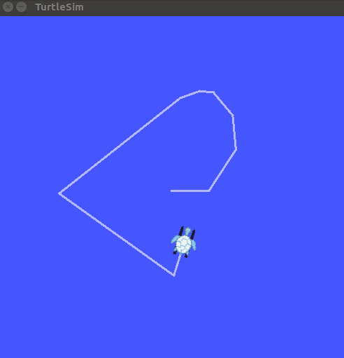
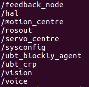
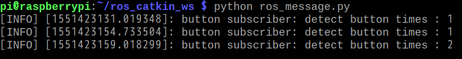

# 使用ROS与机器人多机通信
## 课程目标
&emsp;&emsp;通过本课程我们将会学习通过ROS通信的方式实现：PC与机器人，一台机器人与另一台机器人，一台机器人与多台机器人通信的案例。通过对这些项目的学习让我们更加深入理解ROS在机器人通信中的重要作用。

## 课程引入原因
&emsp;&emsp;ROS开源机器人操作系统，对于很多学生、创客和工程师们来说已经变得越来越重要和流行了。只要我们对ROS消息机制通信原理非常了解，就可以使用这些方法来直接操作教育人形机器人Yanshee的所有功能，实现我们快速控制和使用机器人的目的，也为各个高校、研究院等研究机器人提供更多方法依据和理论支撑。希望本节课的内容能让你更加了解ROS在Yanshee上的深层次使用。也希望通过本节课的学习可以让你快速设计出更加精彩的应用场景。  

## 环境准备
&emsp;&emsp;Ubuntu16.04、至少两台Yanshee机器人。

## 工作原理

&emsp;&emsp;我们使用ROS消息通信机制来完成PC与机器人，机器人与机器人之间的通信。主要使用一个master多个slave的方式进行通信。我们通过特定的文件配置，实现了相应的通信。

## 实践项目

&emsp;&emsp;首先我们应该学习如何在PC端的Ubuntu16.04下安装ROS-Kinetic。一般情况下，我们可以使用下面命令直接安装：  

    sudo apt-get install ros-kinetic-desktop-full

&emsp;&emsp;如果安装成功可以验证下是否成功。  

&emsp;&emsp;我们通过著名的小乌龟例程来验证。分别开三个终端，分别第一个运行roscore、第二个运行：

    rosrun turtlesim turtlesim_node
    
&emsp;&emsp;第三个运行：

    rosrun turtlesim turtle_teleop_key
    
&emsp;&emsp;然后鼠标定在第三个key的终端的地方，使用键盘来控制小乌龟前后左右运动。出现下面类似界面效果代表安装成功。  

      
### 项目1、PC与机器人之间进行ROS通信。

&emsp;&emsp;配置PC端虚拟机Ubuntu16.04 桥接方式到无线网卡。默认让PC的无线网和机器人无线网络处于同一个热点网络下。然后配置两边的/etc/hosts下面增加相应的IP 和hostname 我的虚拟机hostname是ubuntu 机器人树莓派端的hostname为Yan_0A7E，虚拟机Ip地址：10.10.60.199、树莓派IP地址：10.10.61.152然后对相应的sudo nano ~/.bashrc下面最后两行增加相应的rosmaster URI，这个的作用是让PC和机器人使用同一个Rosmaster进行通信。  

&emsp;&emsp;我们要执行下面命令让修改生效：

    source ~/.bashrc

&emsp;&emsp;设置好之后，我们在虚拟机命令行下面输入 rosnode list 发现已经可以看到机器人上面所有的节点了。

  
&emsp;&emsp;然后我们在虚拟机下面建立工作目录：catkin_ws目录下面建立src目录，然后我们在src下面增加ubt_msg文件夹之后，再在catkin_ws目录下运行catkin_make命令编译消息库。

    cd catkin_ws
    catkin_make

&emsp;&emsp;整个catkin_ws目录编译完之后结构如下：

    .
    ├── build
    ├── devel
    ├── ros_test.py
    └── src
          ├── CMakeLists.txt
          └── ubt_msgs
          
&emsp;&emsp;然后同目录下测试文件ros_test.py内容如下：

    #!/usr/bin/env python
    #coding=utf-8
    
    import time
    import rospy
    from ubt_msgs.srv import *
    
    def set_servo_client(x,y,z):
        rospy.wait_for_service('hal_servo_set')
        try:
            servo_set = rospy.ServiceProxy('hal_servo_set', servo_write)
            resp1 = servo_set(x,y,z)
            return resp1.rc
        except rospy.ServiceException, e:
            rospy.logerr("Service call failed: %s",e)
    
    def set_head_angle(angle):
        data = str("FFFFFFFFFFFFFFFFFFFFFFFFFFFFFFFF")
        angle_hex = str(hex(angle))
        end = str("\"}")
        type = 1
        time = 10
        if angle < 16 :
            hexdate=(data+"0"+angle_hex[-1]+end)
            ret = set_servo_client(hexdate,type,time)
        else:
            hexdate = (data + angle_hex[2] + angle_hex[3] + end)
            ret = set_servo_client(hexdate,type,time)
        rospy.logdebug("servo in: %s,%d,%d  return: %d" %( hexdate,type,time,ret))
        
    if __name__ == "__main__":
        rospy.loginfo("This is a test for servo set!")
        #set head servo angle to 60° 
        set_head_angle(60)
        time.sleep(2)
        #set default 90° to reset the head servo 
        set_head_angle(90)
        time.sleep(2)
        #set head servo angle to 120° 
        set_head_angle(120)
        time.sleep(2)
        #set default angle
        set_head_angle(90)

&emsp;&emsp;再运行下面命令：

    source devel/setup.bash

&emsp;&emsp;然后运行下面执行命令进行效果测试：

    python ros_test.py

&emsp;&emsp;测试结果发现机器人头部按照我们的编程开始转动了。可见，我们已经可以通过PC来直接控制机器人了。接下来可以用同样的方法实现机器人举手等动作、TTS、灯光、传感器、视觉等相关功能实现了。

### 项目2、机器人与机器人之间通过ROS通信。
                                                                                       
&emsp;&emsp;我们启动两台机器人，其中一台IP为10.10.61.77另外一台IP为10.10.60.12为了避免重复，我们修改其中一台的hostname为pipi,而另外一台仍然为默认的raspberrypi。具体步骤如下：

&emsp;&emsp;首先，修改10.10.61.77机器人hostname为pipi  

&emsp;&emsp;在机器人终端命令行输入以下命令：

    sudo nano /etc/hostname
    
&emsp;&emsp;改成pipi

&emsp;&emsp;再输入以下命令修改另外一个地方

    sudo nano /etc/hosts
    
&emsp;&emsp;修改127.0.1.1       raspberrypi  这一行为  127.0.1.1       pipi  

&emsp;&emsp;然后重启机器人让修改生效。  

&emsp;&emsp;此时我们就可以按照PC和机器人通信修改配置文件的方法来让一台机器人控制另外一台机器人。具体步骤如下。  

&emsp;&emsp;首先，我们已经拥有了两台机器人，一台hostname为pipi 其IP地址为 10.10.61.77。另外一台hostname为raspberrypi其IP地址为10.10.60.12。现在我们来修改两边的配置文件如下：（我们准备以pipi为master来通信）  

&emsp;&emsp;修改第一台pipi机器人的文件如下：    
&emsp;&emsp;在/etc/hosts文件里面添加一行：

    10.10.60.12     raspberrypi
    
&emsp;&emsp;在~/.bashrc文件最后添加两行：

    export ROS_HOSTNAME=pipi
    export ROS_MASTER_URI=http://10.10.61.77:11311

&emsp;&emsp;最后执行下面命令让修改生效：  

    source ~/.bashrc

&emsp;&emsp;修改另外一台Raspberrypi机器人的文件如下：  

在/etc/hosts文件里面添加一行：

    0.10.61.77     pipi
    
&emsp;&emsp;在~/.bashrc文件最后添加下面两行，来指定master为pipi机器人。

    export ROS_HOSTNAME=raspberrypi
    export ROS_MASTER_URI=http://10.10.61.77:11311
&emsp;&emsp;最后执行下面命令让修改生效：  

    source ~/.bashrc
    

&emsp;&emsp;下面我们将建立ROS工作目录来进行通信测试，我们在第二台raspberrypi机器人里建立工作目录来调用pipi机器人的LED灯ROS节点。建立工作目录：catkin_ws目录下面建立src目录，然后我们在src下面增加ubt_msg文件夹之后，再在catkin_ws目录下运行catkin_make命令编译消息库。  
    
    cd catkin_ws
    catkin_make
&emsp;&emsp;整个catkin_ws目录编译完之后结构如下：  

    .
    ├── build
    ├── devel
    ├── ros_led_test.py
    └── src
          ├── CMakeLists.txt
          └── ubt_msgs
          
&emsp;&emsp;然后同目录下测试文件ros_led_test.py文件内容如下：  

    #!/usr/bin/env python
    #coding=utf-8
    
    import time
    import rospy
    from ubt_msgs.srv import *
    
    def led_handle_client(x,y,z):
        rospy.wait_for_service('hal_led_set')
        try:
            led_function = rospy.ServiceProxy('hal_led_set', led)
            resp = led_function(x,y,z)
            return resp.rc
        except rospy.ServiceException, e:
            rospy.logerr("Service call failed: %s",e)
    
    def head_led_turn_on():
        type = 2 # 1 button 2 head led
        model = 1 #1 on 2 breath
        color = 1 #red
        led_handle_client(type,model,color)
    
    def head_led_turn_off():
        type = 2 # head led
        model = 1 # 1 on 2 breath
        color = 3 #blue
        led_handle_client(type,model,color)
        
    def button_led_blink():
        type = 1 #button
        model = 6 #blink fast
        color = 1 #red
        led_handle_client(type,model,color)
        
    def button_led_normal():
        type = 1 #ubtton
        model = 2 #breath
        color = 3 #blue
        led_handle_client(type,model,color)
        
    if __name__ == "__main__":
        rospy.loginfo("This is a test for led set!")
        #turn head led on 
        head_led_turn_on()
        time.sleep(3)
        head_led_turn_off()
        #button led blink test
        button_led_blink()
        time.sleep(3)
        button_led_normal()
        
&emsp;&emsp;再运行下面命令：

    source devel/setup.bash
    
&emsp;&emsp;然后运行下面执行命令进行效果测试：

    python ros_led_test.py
    

&emsp;&emsp;测试结果发现pipi机器人的led灯按照我们的编程开始活动了。首先头部led灯变红，然后又变蓝色。之后，胸前灯变红色快闪状态，然后恢复蓝色呼吸灯状态。可见，我们已经可以通过一台机器人来直接控制另外一台机器人了。接下来可以用同样的方法实现机器人举手等动作、TTS、跳舞、传感器、视觉等其它相关功能的实现了。当然我们也可以通过ROS消息订阅的方式实现机器人的反向通讯。例如：订阅按键消息之后，就可以在另外一台机器人身上接收master机器人的按键消息了。

### 项目3、一台机器人或PC与多台机器人通过ROS通信。

&emsp;&emsp;本实验通过一台机器人上面的ROS消息机制，来同时发送给两个机器人。实现一对多通信的任务。其具体步骤如下：
&emsp;&emsp;首先在实验2的基础上我们再加入一台机器人，同项目2中的raspberry从机设置步骤一样修改/etc/hosts和~/.bashrc文件指定相应的master主机为pipi机器人。同时修改第三台机器人hostname为newpi。然后建立相应的工作目录catkin_ws编译之后。我们在两台从机机器人的catkin_ws目录下都加入一个测试文件ros_message.py。其内容如下：

    #!/usr/bin/env python
    #coding=utf-8
    
    import rospy
    from std_msgs.msg import Int32
    
    def button_times_callback(msg):
        rospy.loginfo('button subscriber: detect button times : %d', msg.data)
        
    if __name__ == "__main__":
        rospy.loginfo("This is a button msg test use ros!")
        # make a subscriber for button msg
        rospy.init_node('button1')
        rospy.Subscriber('hal_button_info', Int32, button_times_callback)
        rospy.spin()
        
&emsp;&emsp;在另外一台从机的这个文件里，我们需要修改node名称为button2，其它不变。
        
        rospy.init_node('button2')
        
&emsp;&emsp;保证订阅者节点的唯一性。然后同步骤二一样，运行测试文件如下：

    python ros_message.py

&emsp;&emsp;执行结果如下，我们点击pipi机器人的胸前按钮一次之后，发现两台机器人同时接收到了1这个数字的button times，而我们同时点击pipi机器人的胸前按钮两次，发现两台机器人同时接收到了2这个数字的button times。
 
 
&emsp;&emsp;注意点说明：目前机器人本身ROS只支持共用一个master的情况，然后在整个连接的网络内，节点名称要唯一不能重复的，而我们Yanshee机器人默认的节点名称都是一样的，所以要实现一台机器人同时控制多台机器人，需要修改多台机器人的ROS节点名，比如我们想让机器人都做同一个动作，结果我们调用的都是主机器人的master下面的节点。实现起来比较繁琐，因此我们不推荐用ROS来控制多台机器人，而建议使用UDP广播方式实现比较方便一些。而PC端也同样道理。  

&emsp;&emsp;另外一种方法是多机器人开启多master之后，中间通过UDP传送消息，然后将此消息再与ROS节点调用结合起来完成相应的多机器人ROS通信过程。此方法过程本质上仍然是UDP多机通讯。  

## 小结与拓展
&emsp;&emsp;通过本课程，我们主要学习了PC与机器人、机器人与机器人的ROS通信方法与建议，而ROS本身还包含了很多知识库和开源内容。例如moviet运动控制、slam运动导航等等，在后续的课程中，我们会逐渐介绍一些这方面的内容。希望大家能够学以致用，提高自身机器人设计技术。
