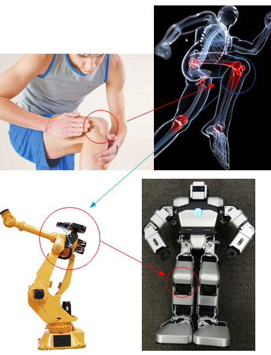
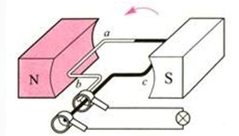
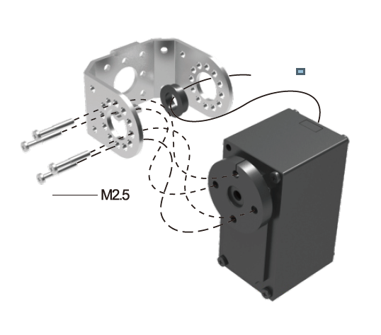
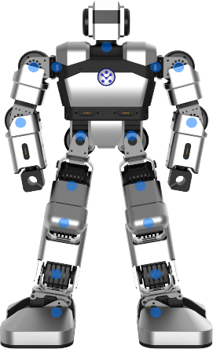
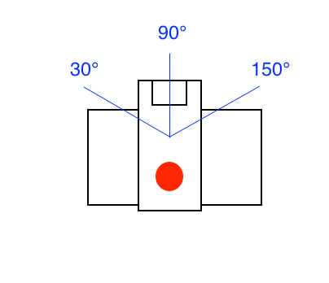

# Getting started with Servo Rotations –The basic movement

## Course Objectives 
&emsp;&emsp;Through this course we can learn what a basic motor steering gear is. When an action is ordered, we complete the corresponding action behavior through the cooperation of several servos. What are their basic principles? In addition, we can also learn a lot about physics and engineering motion knowledge. Finally, we will complete an experiment to control Yanshee robot's head rotation and enhance our understanding and understanding of robot joints and servos.  
## Purpose of This Tutorial
&emsp;&emsp;In nature, from the animal kingdom to humans, the physical activity is accomplished by joint connection and limb interaction. And we need robots to imitate human activities thus they also need to have the corresponding joints in order to move. So there is the emergence of the Servos. Servos can generally be understood as the joints of the robot that are used to control their angle and structure after connecting the complete servo combination action. For example: When a person takes a step forward, our ankle is lifted, the knee flexes forward, and the ankle joint follows. This completes the step forward. It can be understood that no movement is possible without joints. Through the cooperation of the joints, the animals complete the first rotation of their limbs.  

&emsp;&emsp;Let's look at a group of vivid pictures : We can see the evolution from the joints of humans to the joints of robotic arms to the joints of robot Yanshee. Humans complete a knee rotation through the knee joint and biological tissue, and the robot arm and robot complete a basic rotation through their joint servos.

  

  

## Introduction to Basic Concepts and Terminology  

**Ampere force** ：When a current passes through a wire placed in a magnetic field, it will generate a force perpendicular to the direction of the magnetic induction line. This force is called Ampere force.   
 
**Motors and Servomotors** ：Motors are devices that continue to rotate after power is applied. It can convert electrical energy into mechanical energy and drive the movement of machines. The motor places the wire coil in a magnetic field. When the current flows in the coil, opposite forces are generated on both sides of the coil, pushing the coil to rotate continuously and as a result mechanical energy is generated (As shown in the figure: The schematic of the alternator)  
  
   

&emsp;&emsp;The force generated by electromagnetic induction is proportional to the strength of the current circulating in the wire. The greater the current, the greater the resulting amperage. If the direction of the current changes, the direction of the force also changes. Therefore, the magnitude and direction of the motor torque can be controlled by controlling the strength and direction of the current.   
&emsp;&emsp;If we read the motor's working state through the sensor and use the circuit to constantly change the current value of the motor, we can let the motor move in the way we need.    
&emsp;&emsp;The servo comes from the Latin word servus. It was meant to be a slave. This refers to performing an action according to the specified command. Many motors will integrate the control system inside the motor. This motor is a servo motor (shown in the figure). Based on the different applications, the servo motor can usually be divided into three control methods: torque control, speed control and position control. In each control mode, the amount to be controlled is consistent with the input. For example, under speed control, the motor speed is proportional to the input. When the input is increased, the speed is increased. When the input is decreased, the speed is decreased; the input is reduced to 0, and the motor stops rotating.    

      

## Requirements
Hardware requirements：Yanshee robot, a mobile phone with the Yanshee App installed.  

 

Software requirements：Raspberry Pi Raspbian system, Linux system, Python development environment.


### Working Principle:
&emsp;&emsp;The motor used on our Yanshee robot is a servo motor called a steering gear. The name steering gear comes from the fact that it is often used in planes and ship models to control the steering surface.  Compared with ordinary servo motors, these have lower control accuracy. However, due to its low cost and small size, many small robots now use servos for control. The servo is generally composed of several parts: motor, control circuit, reduction gear, sensor and housing.  
&emsp;&emsp;According to the steering angle of the servo, it can be divided into two types: 180 degree servo and 360 degree servo. The 180-degree servo has a limited rotational movement that can only rotate within the range of 0-180 degrees. The 360-degree servo can rotate continuously like an ordinary motor. Yanshee's servo is a 180-degree servo with a maximum range of 180 degrees for each joint. When we give instructions to the servo, the rudder turns to the angle specified in the range of 0-180 degrees.
   
### Example: Using Python Programming to control the robot head servo rotation 

```
#!/usr/bin/python
# _*_ coding: utf-8 -*-

import time
import RobotApi

RobotApi.ubtRobotInitialize()
#------------------------------Connect----------------------------------
gIPAddr = ""
robotinfo = RobotApi.UBTEDU_ROBOTINFO_T()
ret = RobotApi.ubtRobotConnect("SDK", "1", "127.0.0.1")
if (0 != ret):
print ("Can not connect to robot %s" % robotinfo.acName)
exit(1)
#--------------------------Test servo 17-------------------------------
servoinfo = RobotApi.UBTEDU_ROBOTSERVO_T()
# here input the angle you want robot head to rotate
servoinfo. SERVO17_ANGLE = 60
ret = RobotApi.ubtSetRobotServo(servoinfo, 20)
time.sleep(2)
# turn to the default angle 
servoinfo. SERVO17_ANGLE = 90
ret = RobotApi.ubtSetRobotServo(servoinfo, 20)

#--------------------------DisConnection---------------------------------
RobotApi.ubtRobotDisconnect("SDK","1",gIPAddr)
RobotApi.ubtRobotDeinitialize()

```  

### Code Description:
&emsp;&emsp;We use the function 

    RobotApi.ubtSetRobotServo(UBTEDU_ROBOTSERVO_T *servoAngle, int iTime);
      
&emsp;&emsp;To set the angle value for the servo, where the first parameter represents the angle of each Yankee body and the last parameter is the time of the servo movement. By assigning values to servoinfo.SERVO17_ANGLE, we can change the angle of the Yanshee's head servo (SERVO17_ANGLE is the serial number of the head servo. The servo serial number will be explained in the next section).   
&emsp;&emsp;The time parameter is in units of 20ms, that is, when the parameter is 1, the motion time is 20ms. Then, when the function RobotApi.ubtSetRobotServo (servoinfo, 20) is executed, it means that the head will take 400ms to rotate to the 60 degree position.   
&emsp;&emsp;The approximate range of motion of the Yanshee's head servo is shown in the figure below.    
  

## In Subsequent Tutorials: 
&emsp;&emsp;In this tutorial we learnt to control the angle of a steering gear. We can use this method to control the movement of multiple steering gears to achieve corresponding series of actions. In the next lesson we will talk about a series of servo movements and readback programming. Let us walk into the colorful robot control world and take it over.  
<br>
<br>
<br>
 
 


