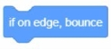

### Sports Building Blocks
#### 1.	Move (10) steps
  
●	Character moves to the right by the specified number of steps

#### 2.	Turn right (15) degrees
  
●   Character turns right by specified angle

#### 3.	Turn left (15) degrees
  
●   Character turns left by specified angle

#### 4.	Move to [random position]
  
●   The character moves randomly or the position of the mouse pointer

#### 5. Move x: (50) y: (0)
  
●  The character moves to the specified coordinate point

#### 6.	Taxi to [random position] within (1) seconds
  
●  The character glides to a random position or the position of the mouse pointer within a specified time

#### 7.	Taxi to x in (1) seconds: (50) y: (0)
  
●  The coordinate point specified by the character on the taxiway within the specified time

#### 8.	Facing (90) direction
  
●  The character faces the specified direction

#### 9.	Facing the [mouse pointer]
  
●  The direction the character is facing the mouse pointer

#### 10. Increase the x coordinate (10)
  
●  Increase the character's x coordinate by the specified value

#### 11. Set the x coordinate to (10)
  
●  Set the character's x coordinate to the specified value

#### 12. Increase the y coordinate (10)
  
●  Increase the character's y coordinate by the specified value

#### 13. Set the y coordinate to (10)
  
●  Set the character's y coordinate to the specified value

#### 14. Bounce at the edge
  
●  When the character hits the edge of the stage, the character changes the direction of movement and moves in the opposite
direction

#### 15. Set the rotation method to [Flip left and right]
  
●  Set the character's rotation method to flip left and right, non-rotatable or arbitrary rotation

#### 16. x coordinates
  
●  Get the value of the x coordinate of the current character

#### 17. y coordinates
  
●  Get the value of the y coordinate of the current character

#### 18. Direction
  
●  Get the direction of the current character
 

