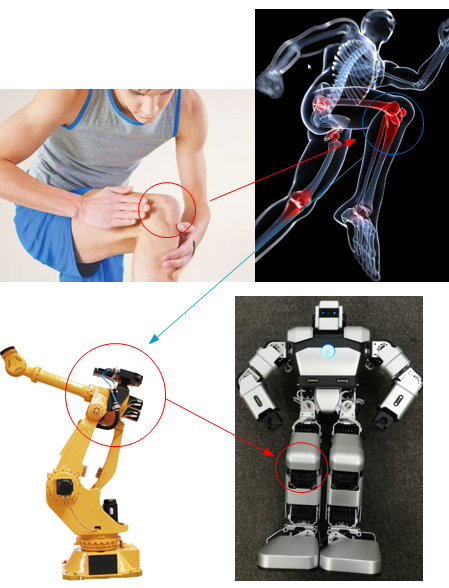
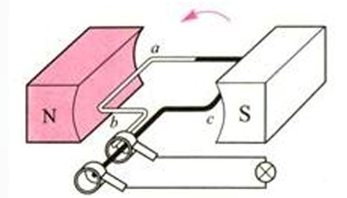
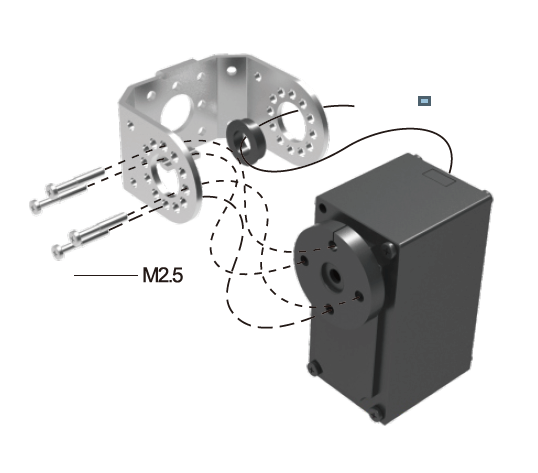
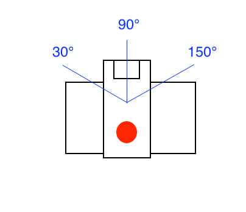

# 机器人生命的第一次转动

## 课程目标
&emsp;&emsp;通过本课程我们可以学到什么是一个基本的动作舵机。当一个动作实现的时候，我们通过几个舵机的合作工作完成相应的动作行为。他们的基本原理是什么呢？除此之外，我们还可以学到很多物理学和工程学运动知识，最后我们会通过一个实验来完成相应的控制Yanshee机器人头部转动的场景，增强我们对机器人关节——舵机的理解和认识。
Yanshee机器人做为一款开源人形教育机器人，我们硬件采用了Raspberry Pi Model 3B，软件采用了基于Raspbian的高度定制系统。基于开源ROS框架的机器人管理套件，也最大限度地提供了教学的灵活性及平台的开放性。
## 课程引入原因
&emsp;&emsp;大自然中，从动物界到人类，它们的肢体活动都是靠关节的连接和肢体的互动完成的。而我们机器人想模仿人类的活动也必须有相应的关节才能活动，于是就有了舵机的出现，舵机一般意义上可以直接理解为机器人的关节，我们通过控制他们的角度和结构件连接之后完成机器人组合动作，例如：当人要迈出向前走一步的动作的时候，我们的胯关节提起、膝关节弯曲向前、踝关节跟着朝上伸出，完成向前走一步的动作。由此可见，没有关节就没有运动可言，通过关节的配合，动物们完成了他们肢体的第一次转动。  

&emsp;&emsp;下面我们看一组生动的图片：   我们可以看到由人的关节到机械臂的关节再到机器人Yanshee的关节的演化过程。   人类通过膝关节和生物组织完成一次膝盖转动，机械臂和机器人通过他们的关节舵机来完成一次基本转动。

  

  

## 基础概念及知识点介绍：  

**安培力** ：置于磁场中的导线有电流流过时，将产生切割磁感应线方向的作用力，这种力被叫做安培力。   
 
**电动机和伺服电机** ：电动机，又称为马达，是一种通电之后持续转动的装置。它可以将电能转化成机械能，驱动其他机器运动。电动机将导线线圈置于磁场中，当电流在线圈中流动时，线圈两侧产生方向相反的力，推动线圈持续的转动，向外输出机械能。（如图所示：交流发电机的原理图）  
  
   

&emsp;&emsp;电磁感应产生的力，与导线中流通的电流强度成正比。电流越大，产生的安培力越大。如果电流的方向改变，力的方向也随之改变。因此，可以通过控制电流的通断、强度和方向，来控制电动机转动力矩的大小和方向。如果我们通过传感器读取电机的工作状态，并且用电路不断改变电机的电流值，就可以让电机按照我们需要的方式运动。这种根据我们指定的输入运动的装置，就是一个伺服系统。伺服（servo）来自拉丁语 servus 一词，本意是奴隶。这里面指的是按照指定的命令，执行动作的含义。很多电机会把控制系统集成在电机内部，这种电机就是伺服电机。（如图所示一个伺服电机）   根据使用场合的不同，伺服电机通常可以分为转矩控制、速度控制、位置控制三种控制方式。每种控制方式下，需要控制的量与输入保持一致。例如，在速度控制下，电机转速与输入成正比，输入增大时，转速随之增大，输入减小时，转速随之减小，输入降低为0，电机则停止转动。  

## 环境准备：
硬件需求：Yanshee机器人一台  

软件需求：树莓派Rasbian系统、linux系统、python环境

### 实物图：  

### Yanshee身上的舵机图：
Yanshee身上一共有十七个舵机。  

### 工作原理：
&emsp;&emsp;在我们Yanshee机器人上使用的电机，是伺服电机的一种，叫做舵机。舵机这个名字源于它常用于航模和船模中控制舵面。和普通的伺服电机相比，舵机的控制精度较低。不过由于成本低，体积小等优势，现在很多小型机器人都使用舵机进行控制。舵机一般由电机、控制电路、减速齿轮组、传感器和外壳几个部分组成  
&emsp;&emsp;按照舵机转动角度的不同，可以分为180度舵机和360度舵机两种。180度舵机里面有限位结构，只能在0-180度范围内转动，360度舵机则可以像普通电机一样连续转动。Yanshee的舵机是180度舵机，每个关节有最大180度的运动范围。当我们给舵机发出指令时，舵机会转到0-180度中指定的角度。
   
### 基础实验：通过python编程实现控制机器人头部舵机转动。
&emsp;&emsp;这里我们使用Yanshee SDK，控制舵机的转动。以下代码可以控制Yanshee头部转动。

**基于YanADK举例**：
```
#!/usr/bin/env python
# -*- coding: utf-8 -*-

import openadk
from openadk.rest import ApiException
from pprint import pprint
import time

configuration = openadk.Configuration()
configuration.host = 'http://127.0.0.1:9090/v1'

api_instance = openadk.ServosApi(openadk.ApiClient(configuration))
body1 = { "runtime": 200,"angles": {"NeckLR": 60}}
body2 = { "runtime": 200,"angles": {"NeckLR": 90}}
try:
    api_response = api_instance.put_servos_angles(body1)
    pprint(api_response)
    time.sleep(2)
    api_response = api_instance.put_servos_angles(body2)
    pprint(api_response)
except ApiException as e:
    print("Exception when calling DevicesApi->put_servos_angles: %s\n" % e)

``` 
**基于RestfulApi举例**：
```
#!/usr/bin/env python
# -*- coding: utf-8 -*-

import requests
import json
import time

def set_servo():
    servo_url = "http://127.0.0.1:9090/v1/servos/angles"
    headers={'Content-Type':'application/json'}
    param = { "runtime": 200,"angles": {"NeckLR": 60}}
    param1 = { "runtime": 200,"angles": {"NeckLR": 90}}
    json_data = json.dumps(param)
    response=requests.put(url=servo_url,data=json_data, headers=headers)
    time.sleep(1)
    json_data = json.dumps(param1)
    response=requests.put(url=servo_url,data=json_data, headers=headers)
    print (response.content)
if __name__ == '__main__':
    set_servo()

```
**老版本1.3.4-7及以下举例**：
```
#!/usr/bin/python
# _*_ coding: utf-8 -*-

import time
import RobotApi

RobotApi.ubtRobotInitialize()
#------------------------------Connect----------------------------------
gIPAddr = ""

robotinfo = RobotApi.UBTEDU_ROBOTINFO_T()
ret = RobotApi.ubtRobotConnect("SDK", "1", "127.0.0.1")
if (0 != ret):
print ("Can not connect to robot %s" % robotinfo.acName)
exit(1)

#--------------------------Test servo 17-------------------------------
servoinfo = RobotApi.UBTEDU_ROBOTSERVO_T()

#在这里填写你希望头部舵机转到的角度
servoinfo. SERVO17_ANGLE = 60
ret = RobotApi.ubtSetRobotServo(servoinfo, 20)
time.sleep(2)

#回到默认90度位置
servoinfo. SERVO17_ANGLE = 90
ret = RobotApi.ubtSetRobotServo(servoinfo, 20)

#--------------------------DisConnection---------------------------------
RobotApi.ubtRobotDisconnect("SDK","1",gIPAddr)
RobotApi.ubtRobotDeinitialize()
```  
### 输出结果：
&emsp;&emsp;通过这个实验我们可以看到，机器人头部转到了我们指定的60度位置，之后又回到了初始90度的位置，实现了头部舵机的一次控制过程。
  
Yanshee头部舵机的运动大致范围如图显示。  



## 拓展阅读：
&emsp;&emsp;有了一个舵机的角度控制，我们就可以通过这个方法来控制多个舵机的运动，进而实现相应的系列动作。下节课我们将讲述一系列舵机的运动和回读编程。完成机器人的运动控制。让我们一起走进丰富多彩的机器人控制世界吧。  
<br>
<br>
<br>
 
 


