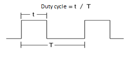
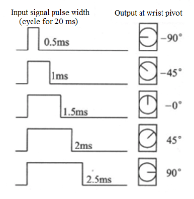
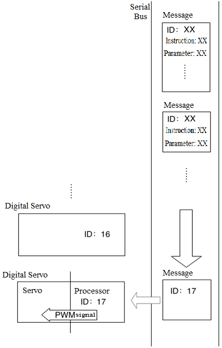
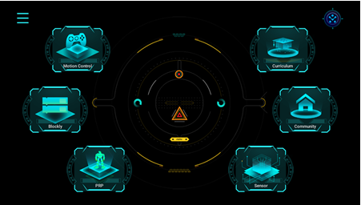
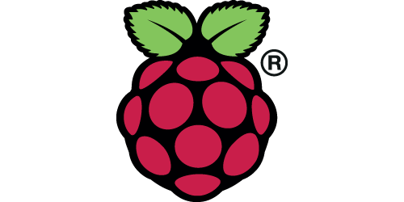
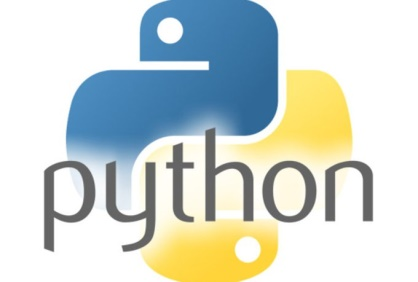
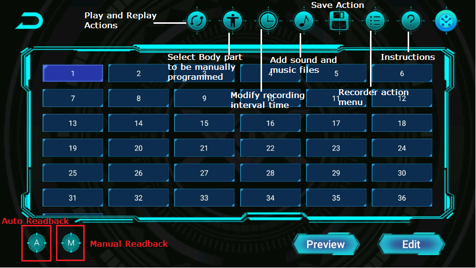
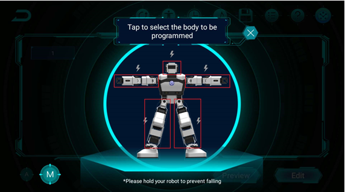
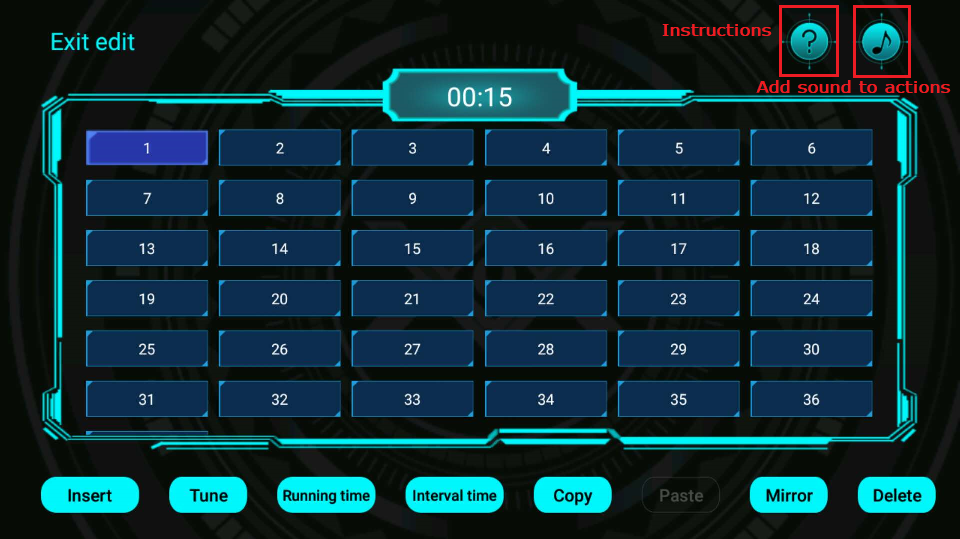
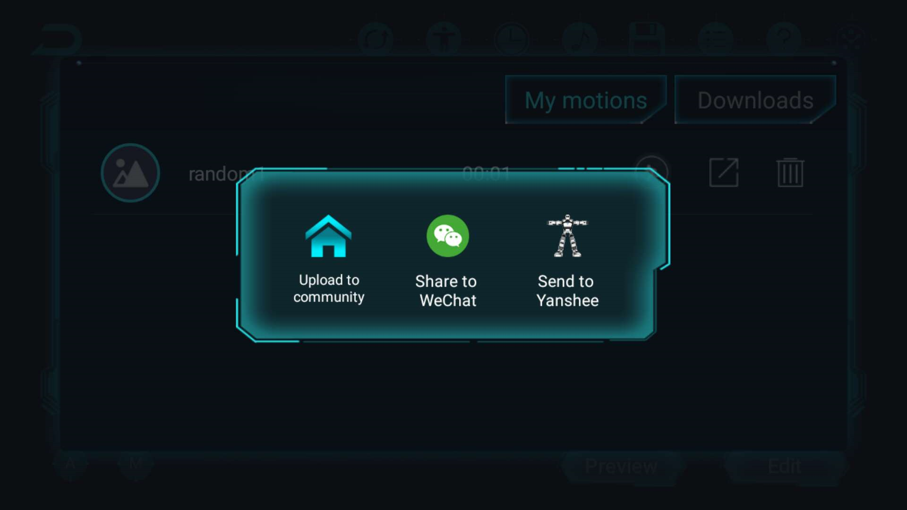

# Servo Readback and Continuous Action Execution

## Course Objectives
&emsp;&emsp;From walking to dancing to playing music, Yanshee robots can make a variety of movements and perform a variety of tasks. How is the robot able to accomplish these tasks? This tutorial will help you learn exactly that.  

&emsp;&emsp;1)	It introduces you to the basic component of the robot movement: Servos and their working principle and explains you how the robot performs various actions.  
 
&emsp;&emsp;2)	You will hands-on operate the Yanshee robot, record and edit a set of actions and execute it on the robot.  

&emsp;&emsp;3)	You will perform and complete some exercises based on robot movements.  

&emsp;&emsp;4)	Finally, you will learn how to use python to incorporate and execute action files. This will help you get familiar with more powerful robot-action programming practices.  

## Purpose of This Tutorial
&emsp;&emsp;In the previous tutorial we learned how the robot’s servo moved. For robots, the servo is equivalent to its "joint". For any arbitrary movement, only being able to rotate the servos does not suffice. More complicated action requires multiple joints to coordinate with each other and get executed together. Human beings accomplish all of this relying on the “nervous system” which consists of the brain at the center and the nerves all over the body. Robots also have similar nervous system. For Yanshee, its nervous system consists of a processor or a microcontroller, a serial bus and a digital servo. These systems work together to allow facilitate to make various movements and actions. This tutorial introduces these concepts in a detailed order.  

## Introduction to Basic Concepts and Terminology 
**Microcontroller：** The single-chip microcontroller is an integrated circuit chip. It is a small, sophisticated microcomputer system integrated into a single silicon chip using VLSI technology. The components integrated on the chip are a CPU with a data processing capability, a random access memory (RAM), a read only memory (ROM), a variety of I/O ports, an interrupt system and a timer/counter function. It may also include circuits such as display driver circuits, pulse width modulation circuits, analog multiplexers, A/D converters, etc. They are widely used in the field of industrial control. There has been a continuous growth in their performance from the 4-bit, 8-bit microcontrollers of the 1980s to the current 300M high-speed ones.    
  
**PWM signal：** PWM is the abbreviation of Pulse Width Modulation and the PWM signal refers to a variable-width pulse waveform. The two main components determining its behavior are the duty cycle and the frequency. The control of the device is achieved by adjusting the duty cycle (the ratio of the pulse width to the total cycle period).  
  


**Duty cycle：** The ratio of the pulse width to the total cycle period. A cycle period is the time taken by a signal to complete an on-and-off cycle.

**Classifications of Servo：** Servo can be divided into analog servo and digital servo. The main difference between these two servos is the difference in control methods. The digital servo can be seen as an analog servo connected to the processor. The analog motor is controlled by the PWM signal. In most cases of practical use, the servo detects the length of the period in which the signal shows a high level to determine the output position or orientation. (Pulse width and output position diagram)  

  

&emsp;&emsp;When the analog servo is running and being simulated, the PWM signal is continuously received from the control terminal at a certain frequency (generally 50 Hz). The angle indicated by each signal is similar to the current angle. Hence, every minor change in the input signal corresponds to a change in the angle rotated at the output. Digital servos also use PWM signals to drive the motor, but they receive a different control signal than the analog servos. In general, digital servos only need to receive a pulse signal to get the angle to be turned. The processor inside the servo analyzes this angle and automatically generates continuous control pulses, which are sent to the servo at a high frequency (300 Hz) to drive it to rotate. This not only makes the control easier, but also improves the frequency of signals received by the servo and also makes the rotation smoother.

**Serial bus and servo ID：**  In general, when the servo is running or being simulated, it receives control signals from the control terminal. However, if all the servos are connected and controlled by a single wire, problems such as complicated control and limited wiring are generally faced. The solution to this problem is to use a serial bus that connects all servos to a single bus. Unlike PWM control, encoded binary messages are transmitted through the bus. Once the servo receives the message, it decodes it according to the protocol being followed and determines the destination of the message (servo ID). When the servo ID of the message is consistent with its own, it responds according to the content of the message. This bus can control multiple servos. In addition to that, with the bus control method, the servo can also transmit signals to the control end, which means that the control end can read all kinds of information about the servo and when the servo fails or functions differently than encoded in the message, it can report in real-time and hence fix and perform the desired function.
  

**Servo Readback:** The structure of the bus makes it possible for the servo to transmit data back to the control terminal. Yanshee's servo uses this feature to facilitate a particular function. When the control terminal sends specific instructions to the servo, the servo can determine the current position using the internal sensor and encode a message containing position information back to the control terminal. The control terminal can record this position information for later use, modification or replay. This process is called readback.
  
**Servo Power Loss:** Only one command input is required for the control input and the digital servo can be stabilized in a fixed position. In fact, inside the digital servo, the drive circuit will continue to send a fixed PWM signal to the servo, locking the servo in a fixed position. If the drive circuit does not send a PWM signal to the servo, the servo will lose power. It leads to the servo being "softened" and then one can easily manually turn the servo by hand. This state is the off state of the servo. In contrast when the servo is "hardened" or the state in which it is receiving continuous PWM signals, it becomes difficult to move manually and is called the power-on state.  

**Servo Self-Protection State：** In the power-on state the servos are locked and do not easily move by manual force. However, if a large load is placed on the servos or if the servo is tried to manually move with a huge force, after a certain period of time the robot servo moves into a state in which it no longer responds to various controls. This means the self-protection state of the robot servos has been triggered. When the servo motors are working they generate a certain amount of heat. If the amount of current flowing in the system is large, the heat generated exceeds the amount of heat that can be dissipated by the system and it will continue to heat up and burn out the servo circuit and structure. Therefore, the digital servo has a series of sensors to monitor the functioning state of the servo. If a risk of overheating of servos is detected at any point, it force-stops working to prevent any damaged. When Yanshee's servo moves into the self-protection state, the LED on the servo will begin and continue to flash. This should be used by the user as an indication to restart the robot and let the servo cool down and return to normal operation state.  

## Requirements
Hardware requirements: Yanshee robot, a mobile phone with the Yanshee App installed.  

   

Software requirements: Raspberry Pi Raspbian system, Linux system, Python development environment.  

    

## Working Principle
**Yanshee Readback Programming procedure and principle:** In humanoid robots like Yanshee the posture can be represented as a set of angles of all the servos. Therefore, recording a set of angles for all the servos is equivalent to recording the robot's posture or current gesture. We can send instructions to the robot at any given moment and let the servos rotate the recorded angle to reproduce the desired gesture. If we save multiple postures of the robot and execute them at regular intervals, a continuous robot movement is created. The postures that build this motion are like individual frames of a video. Hence we call the set of recorded servo angles as data recordings and execution times as action frames. It is a series of consecutive action frames that constitute a coherent robotic action.    
 
In Yanshee's app, we can readback the robot's posture/pose and edit it to execute desired movements. Click "PRP" on the Home screen interface and then the "Programming" button to enter the readback programming interface. Click the button in the upper right corner to connect the robot.  

  

  

Click on the manual readback button (with letter M written) in the lower left corner. Once the manual readback button is clicked, the interface in which the robot part to be programmed can be manually selected.  
   
In this interface, when clicked on the robot's limb, the corresponding servo is powered down which makes it convenient for users to manually move or rotate since it is now in “softened. Clicking on a limb that has been powered-off again will cause the corresponding servo to power up and return to its original position. 

  

Now clicking the manual readback button will record this gesture. Following these steps, the user can record multiple gestures. When clicked on the preview button, the robot starts from the beginning and performs these gestures consecutively to form a coherent action.  
  
  

One major problem with this edited action is that the execution is slow. To fix it  you need to use the editing features. Click the edit button to enter the edit mode. Click on an action frame to select it. The button on the toolbar below the screen will light up. Select the length of time and interval in the toolbar, you can adjust the length of time the action frame is executed. The execution time/run length indicates the time from the beginning to the end of the action and the interval duration indicates the length of time to wait before the next frame starts after the end of the action. Adjusting these data can control the speed and rhythm of the action and be set to the user’s needs.    

The user can click the Save button to save the action to the phone. The angular data, execution time/run length and interval duration of each action frame of the action are stored in a file. In the action list, the user can view all the saved actions and access and open the actions for editing.
  
By clicking on the share button in the list, the user can also send the action file to the Yanshee robot and execute it with the code.  

  


## Example: Using Python Programming for corresponding Robot Action File call  
&emsp;&emsp;We use the Yanshee SDK encoding interface to implement continuous action file execution. The following code runs an action file called "Hit left".  
```
#!/usr/bin/python
# _*_ coding: utf-8 -*-

import time
import RobotApi

RobotApi.ubtRobotInitialize()
#------------------------------Connect----------------------------------------
gIPAddr = ""

robotinfo = RobotApi.UBTEDU_ROBOTINFO_T()
#The robot name you want to connect
robotinfo.acName="Yanshee_0A7E"
ret = RobotApi.ubtRobotDiscovery("SDK", 15, robotinfo)
if (0 != ret):
        print ("Return value: %d" % ret)
        exit(1)

gIPAddr = robotinfo.acIPAddr
ret = RobotApi.ubtRobotConnect("SDK", "1", gIPAddr)
if (0 != ret):
        print ("Can not connect to robot %s" % robotinfo.acName)
        exit(1)

#---------------------------Do one action-----------------------------------
#actionName = ['Forward','Hit left','Hit right','Left slide tackle','reset','Right']
iRepeat = 1
#for name in pcName:
actionName = "Hit left"
ret = RobotApi.ubtStartRobotAction(actionName,iRepeat)
if ret != 0:
    print("Can not start robot action! Error Code: %d" % ret)
    exit(3)
#---------------------------Disconnect--------------------------------------
RobotApi.ubtRobotDisconnect("SDK","1",gIPAddr)
RobotApi.ubtRobotDeinitialize()

```
**Code Description:**  
&emsp;&emsp;We use the RobotApi.ubtStartRobotAction(actionName, iRepeat) function to instruct the robot to execute the action file, actionName is the name of the file, iRepeat is the number of times the action is repeated and 0 means keep executing the action. You can use the RobotApi.ubtStopRobotAction() function to stop the action being performed. For more API instructions please refer to the relevant SDK user manual or the previous chapter.  
  
**Code Execution:**  
&emsp;&emsp;Save the file as hitleft.py and observe the effect in the robot action after executing python hitleft.py under /home/pi.
  
**Advanced Experiment:**  Yanshee doing push-ups  
&emsp;&emsp;Write your own push-up.hts by reading back programmatically. Name it push_up.hts. Then copy it to the corresponding robot directory and complete the Python code call under mnt/1xrobot/res/hts and execute it.

## In Subsequent Tutorials:   
&emsp;&emsp;In this tutorial we learned how to edit an action file using the App and then how to use Python interface to complete the corresponding action. This process is very useful in practical applications. In the following tutorials we will run the corresponding robot motion files to complete the comprehensive application scenario we want through various input links including speech input, visual input, sensor input and so on. For example, in the game of palms we will program the robots perform actions such as squatting and waving. In the fall-management section, we will program robots stand up and move. In brief, this lesson is an important foundation for following courses. Continuous robotic movements have played a major role in the human-computer interaction.  
<br>
<br>
<br>
