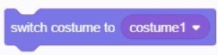
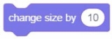
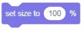
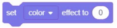
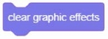
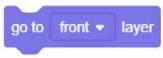
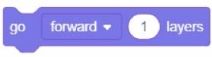
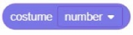
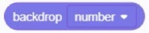
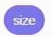

### Appearance building blocks	
#### 1.	Say (), () seconds
  
●	A dialogue bubble pops up at the top right of the character, showing you the "entered text" and disappearing after displaying the number of seconds you set.

#### 2.	say ()
  
●   A dialogue bubble pops up in the upper right of the character, showing "The text you entered".

#### 3.	Thinking (), () seconds
  
●   A thought bubble pops up at the top right of the character, showing you "the text you entered", and disappears after continuously displaying the number of seconds you set.

#### 4.	Thinking ()
  
●   A thought bubble pops up in the upper right of the character, showing "The text you entered."

#### 5.	Change to [Styling 1]
  
●  The character switches to the specified look.

#### 6.	The next look
  
●  Switch the character's look to the next look. If the current character is the last one in the list, it will loop to the first one.

#### 7.	Change to [Background 1] Background
  
●  The background switches to the specified background. Press r to switch the background to Baskeball 1

#### 8. Next background 
  
●  Switch the background to the next background. If the current background is the last in the list, loop to the first.

#### 9.	Increase the size ()
  
●  Increase the character size by a percentage of "You enter a value", and negative numbers decrease.

#### 10. Set the size to ()
  
●  Set the character size as a percentage of the value you enter.

#### 11. Increase the [Color] effect ()
  
●  Increase the character's [Color / Fisheye / Swirl / Pixelation / Mosaic / Brightness / Virtual Image] effects by a percentage of "the number you entered", and decrease the negative number.

#### 12. Set the [Color] effect to ()
  
●  Set the [Color / Fisheye / Swirl / Pixelation / Mosaic / Brightness / Dotted Line] effect to a percentage of "the value you
entered".

#### 13. Clear graphics effects
  
●  Clear all effects from the character.
●  When the character is clicked, clear all the effects of the character

#### 14. Display
  
●  Display the character in the running program so that the player can see the character.

#### 15. Hide
  
●  Hide the character in the running program so that the player cannot see the character.

#### 16. Move to the front [front]
  
●  Move the character to the front [front / back] of the layer.

#### 17. [forward] () layer
  
●  [Front / Back] The number of layers where you enter the value.

#### 18. Modeling [number]
  
●  [Number / Name] of the character model
●  Example: When the green banner is clicked, the character will display the shape name through a dialog box.

#### 19. Background [number]
  
●  [Number / Name] of the stage background.

#### 20. Size
  
●  Role size.

