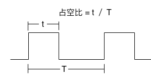
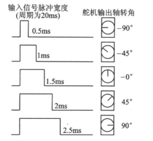
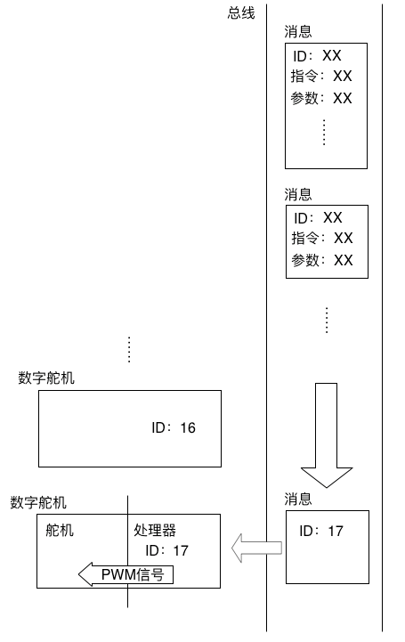
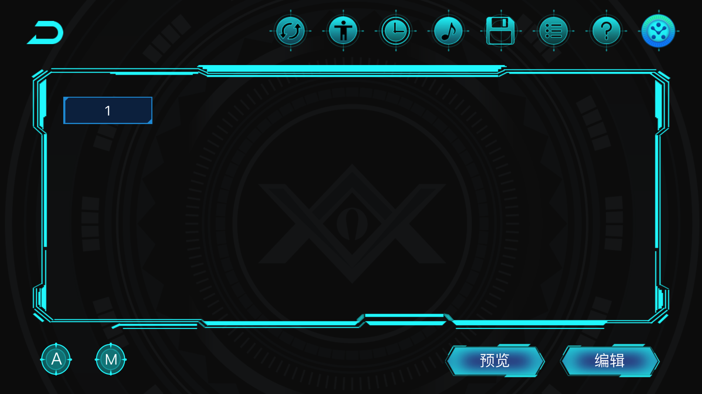
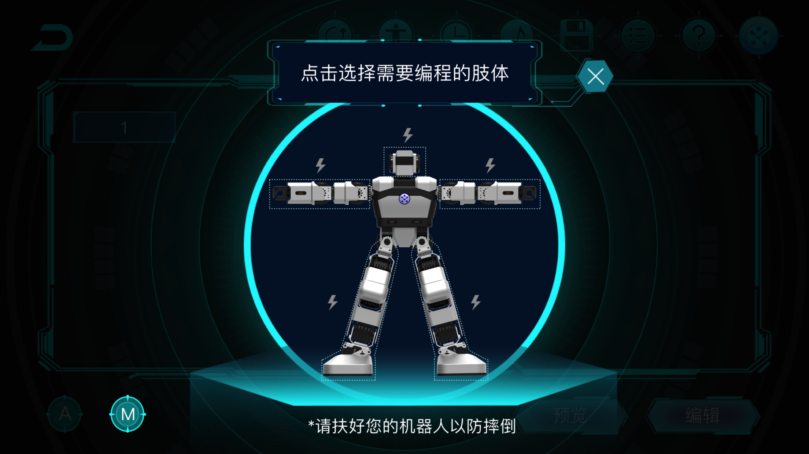
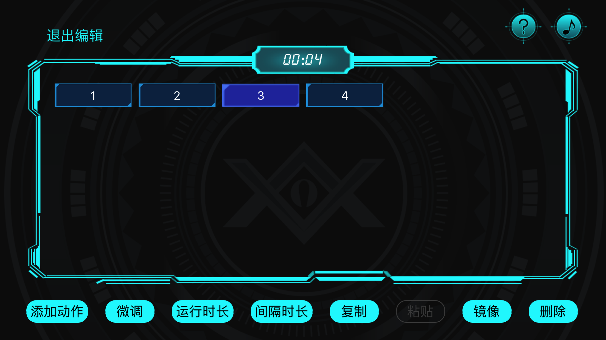
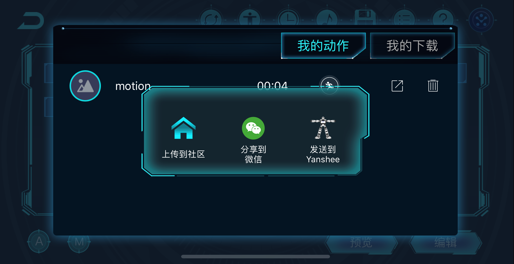

# 舵机回读与连续动作执行

## 课程目标
&emsp;&emsp;从向前走路到跟着音乐跳舞，Yanshee机器人可以做出各种各样的动作。机器人是怎样做出这些动作的呢？本节课将从机器人运动的基本元件：舵机的工作原理讲起，向你介绍机器人是如何做出动作的。你将亲手操作Yanshee机器人，录制和编辑一组动作，在机器人上执行。并完成机器人各种动作编排的练习。最后你可以学会如何通过python来调用动作文件完成更加强大的机器人动作编程实践。
## 课程引入原因
&emsp;&emsp;在前一节课我们学习了机器人的舵机是如何动起来的。对于机器人来说，舵机相当于它的“关节”。仅仅能够转动关节，还不能随心所欲的运动。一个复杂一点的动作，需要多个关节相互协调，共同完成。  
  
&emsp;&emsp;人类完成这一切，依靠的是中枢的脑和遍布全身的神经。机器人也有类似的“神经系统”。对于Yanshee来说，它的“神经系统”是单片机、串行总线和数字舵机的处理器。这些系统共同作用，才能让Yanshee作出各种动作。这节课我们将陆续介绍这些重要的概念。
下面我们看一组生动的图片：   我们可以看到由人的关节到机械臂的关节再到机器人Yanshee的关节的演化过程。   人类通过膝关节和生物组织完成一次膝盖转动，机械臂和机器人通过他们的关节舵机来完成一次基本转动。

## 基础概念和术语介绍 
**单片机：** 单片机是一种集成电路芯片，是采用超大规模集成电路技术把具有数据处理能力的中央处理器CPU、随机存储器RAM、只读存储器ROM、多种I/O口和中断系统、定时器/计数器等功能（可能还包括显示驱动电路、脉宽调制电路、模拟多路转换器、A/D转换器等电路）集成到一块硅片上构成的一个小而完善的微型计算机系统，在工业控制领域广泛应用。从上世纪80年代，由当时的4位、8位单片机，发展到现在的300M的高速单片机。  
  
**PWM信号：** PWM是脉冲宽度调制的缩写，指的是一种宽度可变的脉冲波形。通过调整占空比（脉冲宽度占整个周期的比）实现对设备的控制。  
  
**占空比：** 在一个脉冲周期内，通电时间占总时间的比例。（下面是一个占空比示意图）

  


**舵机的分类：** 舵机可以分为模拟舵机和数字舵机两种。这两种舵机主要区别是控制方式的不同。数字舵机可以看作模拟舵机基础上添加了处理器。模拟电机是通过PWM信号进行控制的。在实际使用中，舵机通常检测高电平的长度来确定输出的位置。（脉冲宽度与输出位置关系图）  

  

 &emsp;&emsp;模拟舵机运行时，以一定频率（一般为50Hz）不断从控制端接收PWM信号。每个信号所指示的角度都与当前的角度相差不多。每次旋转一点角度，最后转到目的位置。数字舵机也要用PWM信号驱动电机，但它接收的控制信号与模拟舵机不同。通常来说，数字舵机只需要接收一个脉冲信号，获取到需要转到的角度。舵机内部的处理器对这个角度分析，自动产生连续的控制脉冲，以很高的频率（300Hz）发送给舵机，驱使舵机旋转。这样不但让控制变得更简单，提高舵机接收的信号频率，也能让转动更加流畅。

**串行总线及舵机ID：** 一般来说，舵机在运行时，从控制端接收控制信号。如果每个舵机都单独拉一根线，不但控制比较复杂，而且对布线也限制很大。解决这个问题的办法是采用串行总线，即把所有舵机接到一根总线上。与PWM控制不同，总线上传输的是编码过的二进制消息。舵机接收到消息后，按照协议解析，判断消息的目的地（舵机ID）。当消息目的地的ID与自己一致时，就依照消息内容，做出相应的反应。这样一根总线就能控制多个舵机。不仅如此，采用总线的控制方式，舵机也可以传输信号给控制端，这意味着控制端可以读取舵机的各种信息，舵机出现故障时也能及时上报，进行相应的处理。
  

**舵机回读：** 总线的结构使舵机向控制端回传数据成为了可能。Yanshee的舵机就有这样的功能。当控制端发送特定指令给舵机时，舵机可以从内部的传感器读取当前的位置，并组装一条包含位置信息的消息传回控制端，控制端可以将这个位置信息记录下来以供以后使用。这个过程我们叫做回读。
  
**舵机掉电：** 控制输入只需要输入一次指令，数字舵机就能稳定在固定位置。实际上在数字舵机内部，驱动电路会持续发送固定的PWM信号给舵机，将舵机锁在固定位置。如果驱动电路不给舵机发送PWM信号，舵机就会失去动力。表现出来就是舵机“变软”，人可以轻易用手掰动舵机转动。这种状态就是舵机的掉电状态。相对的，舵机“变硬”，难以掰动的状态称作上电状态。  

**舵机保护：** 尽管上电状态下，舵机很难掰动，但如果用户非常用力去掰它，或者在舵机上施加一个较大的负载，持续一段时间后，舵机会突然进入一种类似掉电的状态，不再响应各种控制。这实际上是触发了舵机的自我保护功能。电机工作时，会产生一定的热量，如果电流很大，产生热量超过了散热的能力，就会持续升温，烧坏舵机电路或结构。因此，数字舵机有一系列传感器监测舵机的工作状态，一旦发现舵机有过热风险，就会停止工作，防止舵机被损坏。Yanshee的舵机在自我保护状态下，舵机上的LED会持续闪烁提醒用户，此时用户需要重启机器人，让舵机恢复正常工作状态。  

## 环境准备
硬件需求：Yanshee机器人一台、装有App的手机一部  
软件需求：树莓派Rasbian系统、linux系统、python环境

## 工作原理
**Yanshee回读编程步骤及原理：** 像Yanshee这样的人形机器人，它的一个姿态可以由所有舵机的角度共同表示。因此，记录了一组全部舵机的角度，就相当于记录了机器人的姿态。我们可以随时向机器人发送指令，让舵机转到记录的角度，重现这个姿态。如果我们保存多个机器人的姿态，按照一定时间间隔执行起来，这就形成了一个机器人的连续动作。构成这个动作的逐个姿态，就像电影胶片的每一帧一样，因此我们把这些记录了一组舵机角度和执行时间的数据称作动作帧。一系列连续的动作帧，构成一个连贯的机器人的动作。  
  
  

在Yanshee的App里，我们可以回读机器人的姿态，编辑自己的动作。在Home界面点击「回读编程」按钮，进入回读编程界面，点击右上角按钮，连接机器人之后。点击左下角手动回读按钮（写有M字母），会跳出选择肢体界面。  

  

 在选择肢体界面，点击机器人的肢体，该部分身体对应的舵机会掉电，方便用户掰动。再次点击已经掉电的肢体，将会使机器人在原来位置上电。当用户将机器人掰到一个合适的位置时，可以点击手动回读按钮，记录这个姿态。通过这种操作，用户可以记录多个。点击预览按钮，机器人将从头开始执行，把这些姿态穿起来，组成一个连贯的动作。  
 
  

这样编辑出来的动作会有一个问题，就是执行的速度比较缓慢。这时候就需要用到编辑功能。点击编辑按钮进入编辑模式。点击一个动作帧选中它，屏幕下方工具栏的按钮将会亮起。在工具栏里选择运行时长和间隔时长，可以调整动作帧执行的时间长短。运行时长表示动作开始到结束的时间长短，间隔时长表示运动结束之后，下一帧开始之前等待的时间长短。调整这些数据，可以控制动作的速度和节奏，配合用户的需求。  
  
  

用户可以点击保存按钮将动作保存到手机中。动作的每一个动作帧的角度信息和执行时间、间隔时间都会保存在一个文件里。在动作列表中，用户能看到保存的所有动作，打开以前的动作进行编辑。点击列表中的分享按钮，用户还能将动作文件发送到Yanshee机器人上，用代码执行。  

## 举例：通过python编程来实现相应的机器人动作文件调用。  
&emsp;&emsp;下面我们使用YansheeSDK接口来实现连续动作文件的执行。


**基于YanADK举例**：
```
#!/usr/bin/env python
# -*- coding: utf-8 -*-

import openadk
from openadk.rest import ApiException
from pprint import pprint
import time

configuration = openadk.Configuration()
configuration.host = 'http://127.0.0.1:9090/v1'

api_instance = openadk.MotionsApi(openadk.ApiClient(configuration))
    
startTime = int(time.time())
#speeds = ['none','very slow', 'slow', 'normal', 'fast', 'very fast']
body = {
  "motion": {
    "direction": "left",
    "name": "raise",
    "repeat": 3,
    "speed": "normal"
  },
  "operation": "start",
  "timestamp": startTime
}
body1 = {
  "motion": {
    "name": "bow",
    "repeat": 1,
    "speed": "very slow"
  },
  "operation": "start",
  "timestamp": startTime
}
body2 = {
  "motion": {
    "name": "Waka_waka",
    "repeat": 1
  },
  "operation": "start",
  "timestamp": startTime
}
body3 = {
  "motion": {
    "name": "Reset",
    "repeat": 1
  },
  "operation": "start",
  "timestamp": startTime
}
try:
    api_response = api_instance.put_motions(body=body,async_req=False)
    pprint(api_response)
except ApiException as e:
    print("Exception when calling DevicesApi->put_devices_led: %s\n" % e)

```
&emsp;&emsp;注意：我们可以把上面代码中body=body右侧的body换成body1、body2、body3让机器人做不同的动作。

**基于RestfulAPI举例**：
```
import requests
import json
import time

def set_motion():
    timestamp = int(time.time())
    motion_url = "http://127.0.0.1:9090/v1/motions"
    headers={'Content-Type':'application/json'}
    param={
        "operation": "start",
        "motion": {
        "name": "raise",
        "direction": "left",
        "repeat": 1,
        "speed": "normal"
        },
        "timestamp": timestamp
    }
    json_data = json.dumps(param)
    response=requests.put(url=motion_url,data=json_data, headers=headers)
    print (response.content)
if __name__ == '__main__':
    set_motion()

```
**老版本1.3.4-7及以下举例**：
```
#!/usr/bin/python
# _*_ coding: utf-8 -*-

import time
import RobotApi

RobotApi.ubtRobotInitialize()
#------------------------------Connect----------------------------------------
gIPAddr = ""

robotinfo = RobotApi.UBTEDU_ROBOTINFO_T()
#The robot name you want to connect
robotinfo.acName="Yanshee_0A7E"
ret = RobotApi.ubtRobotDiscovery("SDK", 15, robotinfo)
if (0 != ret):
        print ("Return value: %d" % ret)
        exit(1)

gIPAddr = robotinfo.acIPAddr
ret = RobotApi.ubtRobotConnect("SDK", "1", gIPAddr)
if (0 != ret):
        print ("Can not connect to robot %s" % robotinfo.acName)
        exit(1)

#---------------------------Do one action-----------------------------------
#actionName = ['Forward','Hit left','Hit right','Left slide tackle','reset','Right']
iRepeat = 1
#for name in pcName:
actionName = "Hit left"
ret = RobotApi.ubtStartRobotAction(actionName,iRepeat)
if ret != 0:
    print("Can not start robot action! Error Code: %d" % ret)
    exit(3)
#---------------------------Disconnect--------------------------------------
RobotApi.ubtRobotDisconnect("SDK","1",gIPAddr)
RobotApi.ubtRobotDeinitialize()

```

**代码执行：**  
&emsp;&emsp;保存文件为hitleft.py，在/home/pi下面执行 python hitleft.py 之后观察机器人动作效果。
  
**高级实验：**  会做俯卧撑的Yanshee  
&emsp;&emsp;自己通过回读编程编写一套做俯卧撑的动作，命名为push_up.hts. 然后拷贝到相应的机器人目录、mnt/1xrobot/res/hts下完成python代码调用，并执行。
## 拓展阅读  
&emsp;&emsp;通过本节的学习，我们学会了如何通过App来编辑一个合适的动作文件，然后如何通过python接口调用来完成相应的动作，这个过程在实际应用中用处很大。后续章节我们将通过各种输入环节包括：语音输入、视觉输入、传感器输入等等来驱动相应的机器人动作文件完成我们想要的综合应用场景。比如手掌游戏环节，我们会让机器人做蹲下、挥手等动作。摔倒管理环节我们会让机器人做出后撑地站起动作等等，总之，这节课是后续课程的重要基础。连续的机器人动作为人机交互体验起到了支撑性作用。  
<br>
<br>
<br>
