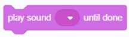
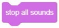
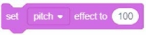
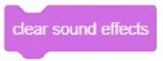
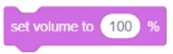

### Sound building blocks	
#### 1.	Play the sound [recording] and wait for it to finish
  
●	Play the sound of your choice and wait for it to finish executing the script below.

#### 2.	Play the sound [recording]
  
●   Play the sound of your choice and execute the following script at the same time.

#### 3.	Stop all sounds
  
●  	Stop all sounds currently running

#### 4.	Increase the [tone] sound effect ()
  
●   Increase the [Tone / Left / Right Balance] sound effect by a percentage of "You enter the value", and negative numbers decrease.

#### 5.	Set the [Tone] sound effect to ()
  
●  Set the [Sound Effect / Left and Right Balance] sound effect as a percentage of "You enter the value".

#### 6.	Clear sound effects
  
● 	Clear all sound effects from the character.

#### 7.	Increase the volume ()
  
●  Increase the volume by "you enter a value" by a percentage, and negative numbers decrease.

#### 8.	Set the volume ()% 	
  
●  Set the volume as a percentage of "You enter a value."

#### 9.	Volume
  
●  Monitor the volume of characters and the stage
 
