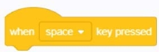
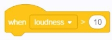

### Event building blocks	
#### 1.	When the green banner is clicked
  
●	When the green banner is clicked, immediately execute the script example under this block: when the green

#### 2.	When the [Space] key is pressed
  
●   When the keyboard presses the [Space /] key, the script under this block is immediately executed

#### 3.	When the character is clicked
  
●  	When the character is clicked, immediately execute the script under this block

#### 4.	When the role is changed to [Background 1]
  
●   When the character background is changed to "the background you specified", immediately execute the script under this block

#### 5.	When [loudness] is greater than ()
  
●  When [loudness / timer] is greater than "you enter the value", the script under this block is executed immediately

#### 6.	When [message 1] is received
  
● 	When the specified message is received, the script under this block is immediately executed

#### 7.	Broadcasting [message]
  
●  Send a broadcast to all characters (background) to inform the character (background) that received the broadcast content to perform some action

#### 8.	Broadcast [message 1] and wait
  
●  Send a broadcast to all characters (background) to notify the character (background) that received the broadcast content to perform certain actions and wait for some actions initiated by the broadcast to complete.
