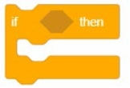
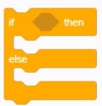

### Controlling building blocks	
#### 1.	Wait for () seconds
  
●	For the separated blocks, wait for the "entered value" and execute the following script

#### 2.	Repeat () times
  
●   Repeat the script blocks contained in the "Entered Value" blocks. The default value is 10 times.

#### 3.	Repeat
  
●  	Repeat an infinite number of times to execute the script blocks contained in the blocks

#### 4.	Use [My Variables] to step from (i) to (j) to (n)
  
●   Define my variable with an initial value of i, an end value of j, and a step size of n. Each time i increases by n (i = i + n), the script blocks included are executed when i is less than j, otherwise the loop blocks are skipped.  
● 	Example:  

for (i = 1; i <=10, i ++)  
{  
Loop body statement;  
}  
This loop will be executed 10 times (in the case of i = 1 to i = 10) Its execution process is this:
First assign an initial value of 1 to the variable i, and then judge, if the condition i <=10 (yes) is satisfied, the statement of the loop body is executed, and then i ++ is completed, that is, i = i + 1; i becomes 2 and then judges If the condition i <=10 is satisfied (still), the statement of the loop body is executed again, and i ++ is continued after completion. When i becomes 11,it is judged whether the condition i <=10 is satisfied, and it is found that it is no longer satisfied, and then exits the loop.

#### 5.	If <condition> then ()
  
●  If the embedded <condition> is true, the script block contained in the "if" block is executed, otherwise the block is skipped.

#### 6. If <condition> then () otherwise ()
  
● 	If the embedded <condition> is true, execute the script blocks contained in the "if" block, otherwise execute the script blocks contained in the "other" block.

#### 7.	wait ()
  
●  Use to separate building blocks, wait for embedding <condition> to run, run the following building block script, otherwise wait

#### 8.	Repeat until ()
  
●  Repeat the included script blocks until the embedded <condition> is satisfied, then run the script blocks under this block

#### 9.	Stop [All Scripts]
  
●  Stop execution of [All scripts / This script / Other scripts of this role]

#### 10. When started as a clone
  
●  When the clone is generated, execute the script block under this block.

#### 11. Clone [self]
  
●  Clone yourself or another character's clone

#### 12. Delete this clone
  
●  Delete the clone
