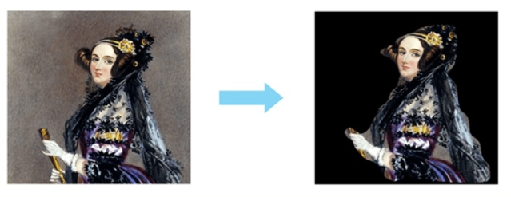
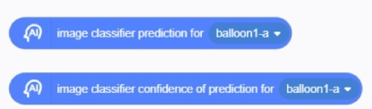

### AI building blocks 	
  
#### 1.	AI-image segmentation
  
●   This building block can recognize the human silhouette of a character on the stage, separate the background from the portrait, and retain only the basic portrait. Note that this building block usually only works for portrait pictures with background.    
●   Working principle: This building block uses the open source machine learning model bodyPix, which allows for image segmentation of images or videos in uCode. In real-life application scenarios, portrait segmentation technology can be used for matting and beautification, human body special effects, and post-processing of film and television.  

●   Preview of running effect:  
  

#### 2. Real-time portrait segmentation of video
  
●   This building block can split the portrait of the video stream, separate the background from the portrait, and only keep the basic portrait.  
●   Working principle: This building block uses the open source machine learning model bodyPix, which allows for image segmentation of images or videos in uCode. In real-life application scenarios, portrait segmentation technology can be used for matting and beautification, human body special effects, and post-processing of film and television.

#### 3.	Posture detection on character modeling
  
●   This building block can perform real-time pose prediction on the character modeling on the stage.   
●   Working principle: This building block uses the open source machine learning model PoseNet, which can predict poses of key positions of the human body in images or videos

#### 4.	Posture detection on video
  
●   This building block can perform real-time pose prediction on the human body appearing in the video stream.  
●   Working principle: This building block uses the open source machine learning model PoseNet, which can predict poses of key positions of the human body in images or videos.

#### 5. Image Classification
  
●   This set of blocks can predict the classification of character modeling images and return the corresponding  confidence.    
●   Working principle: This building block uses the open source machine learning model ImageNet, which is trained on a database of about 15 million images (ImageNet). What the model predicts depends on what is included in the training data, what is excluded, and how the images are labeled.