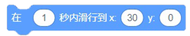

### 运动积木块	
#### 1.	移动（10）步

●	角色向右移动指定的步数

#### 2.	右转（15）度
  
●   角色右转指定的角度

#### 3.	左转（15）度
  
●   角色向左转指定的角度

#### 4.	移到[随机位置]
  

●   角色移动到随机位置或鼠标指针的位置

#### 5.	移动x:（50）  y:（0）
  
●  角色移动到指定的坐标点

#### 6.	在（1）秒内滑行到[随机位置]
  
●  角色在指定的时间内滑行到随机位置或鼠标指针的位置

#### 7.	在（1）秒内滑行道x:（50） y :（0）
  
●  角色在指定的时间内滑行到指定的坐标点

#### 8.	面向（90）方向
  
●  角色面向指定的方向

#### 9.	面向[鼠标指针]
  
●  角色面向鼠标指针的方向

#### 10.将x坐标增加（10）
  
●  将角色的x坐标增加指定的数值

#### 11.将x坐标设为（10）
  
●  将角色的x坐标设为指定的数值

#### 12.将y坐标增加（10）
  
●  将角色的y坐标增加指定的数值

#### 13.将y坐标设为（10）
  
●  将角色的y坐标设为指定的数值

#### 14.碰到边缘就反弹
  
●  当角色运动碰到舞台的边缘时，角色会改变运动的方向，并向相反的方向运动

#### 15.将旋转方式设为[左右翻转]
  
●  将角色的旋转方式设定为左右翻转、不可旋转或任意旋转

#### 16.x坐标
  
●  获取当前角色的x坐标的值

#### 17.y坐标
  
●  获取当前角色的y坐标的值

#### 18.方向
  
●  获取当前角色的方向

