### 外观积木块	
#### 1.	说（），（）秒
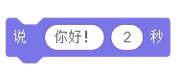  
●	角色的右上方弹出对话气泡，显示你“输入的文本”，并持续显示你设定的秒数后消失  
  

#### 2.	说（）
  
●   角色的右上方弹出对话气泡，显示“输入的文本”

#### 3.	思考（），（）秒
  
●   角色的右上方弹出思考气泡，显示“输入的文本”，并持续显示设定的秒数后消失  
  

#### 4.	思考（）
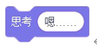  
●   角色的右上方弹出思考气泡，显示“输入的文本”

#### 5.	换成[造型1]造型
  
●  角色切换为指定的造型

#### 6.	下一个造型
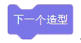  
●  将角色的造型切换到下一个造型。如果当前角色造型为列表最后一个，则循环为第一个造型

#### 7.	换成[背景1]背景
  
●  背景切换为指定的背景  
●  例：按下r键，背景切换为Baskeball 1  
  

#### 8.	下一个背景
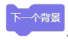  
●  将背景切换为下一个背景。如果当前背景为列表最后一个时，则循环为第一个背景

#### 9.	将大小增加（10）
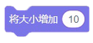  
●  将角色大小增加“输入数值”的百分比，负数则为减小

#### 10.将大小设为（100）
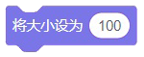  
●  将角色大小设定为“输入数值”的百分比

#### 11.将[颜色]特效增加（25）
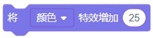  
●  将角色的[颜色/鱼眼/漩涡/像素化/马赛克/亮度/虚像]特效增加“输入数值”的百分比，负数则为减少

#### 12.将[颜色]特效设为（0）
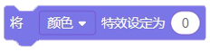  
●  将角色的[颜色/鱼眼/漩涡/像素化/马赛克/亮度/虚像]特效设定为“输入数值”的百分比

#### 13.清除图形特效
  
●  清除角色的所有特效  
●  例：当角色被点击时，清除该角色的所有特效  
  

#### 14.显示
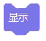  
●  将角色在运行程序中显示，使玩家可以看见该角色

#### 15.隐藏
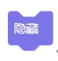  
●  将角色在运行程序中隐藏，使玩家无法看到该角色

#### 16.移到最[前面]
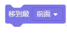  
●  将角色移到图层的最[前面/后面]

#### 17.[前移]（）层
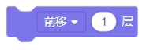  
●  将角色[前移/后移]“你输入数值”的层数

#### 18.造型[编号]
  
●  角色造型的[编号/名称]   
●  例：当绿色旗帜被点击时，角色会通过对话框的方式显示造型名称  
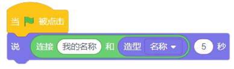  

#### 19.背景[编号]
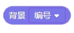  
●  获取当前舞台背景的[编号/名称]

#### 20.大小
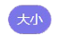  
●  获取角色的大小

