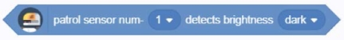
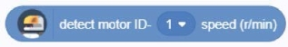
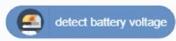
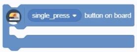
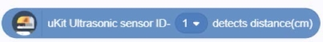
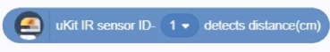
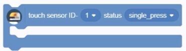
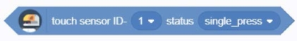
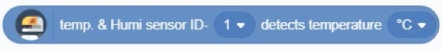
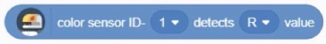

###  感知积木块

#### 1.	Line inspection sensor num- [01] detects [deep]
  
●   When the color detected by the line-tracking sensor at the specified detection port is [deep or light], the condition of this building block is true

#### 2.	Read the angle of the servo ID- [01] when the status is [non-movable]
  
●   Get the angle of the specified servo at [non-automatic / automatic]

#### 3.	Read the speed of motor ID- [01] (r / min)
  
●   Get the speed of the specified motor

#### 4.	Get the battery voltage
  
●   Get the voltage value of the battery connected to the current Explore

#### 5. Gyroscope [Acceleration (m / s²)] Select [X axis]
  

#### 6. The on-board status of the button is [click]
  
●   If the on-board state of the button is [click / double-click / long press], the script building block included in the building block is executed, otherwise the building block is skipped

#### 7.	uKit ultrasonic sensor ID- [01] Get distance (cm)
  
●   Get the distance of the specified uKit ultrasonic sensor using ultrasonic testing

#### 8.	uKit infrared sensor ID- [01] get distance
  
●   Get the distance tested by the specified uKit infrared sensor

#### 9.	Press sensor ID- [01] status is [click]
  
●   If the status of the specified installation sensor is [click / double-click / long press], the script building block included in the building block is executed, otherwise the building block is skipped

#### 10. Press the sensor ID- [01] status is [click]
  
●   When the status of the specified compression sensor is [click / double-click / long press], the condition of this building block is satisfied

#### 11. Brightness sensor ID- [01] obtains the brightness value (lux)
  
●   Get the brightness value of the specified brightness sensor

#### 12. Sound sensor ID- [01] obtains the sound intensity value
  
●   Get the sound intensity value of the specified sound sensor

#### 13. Humidity sensor ID- [01] Get humidity%
  
●   Gets the humidity percentage of the specified humidity sensor

#### 14. Color sensor ID- [01] detects [R] value
  
●   Get the [R / G / B] value of the specified color sensor

#### 15. Color sensor ID- [01] detects [R] value
  
●   Get the [R / G / B] value of the specified color sensor
