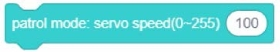

###  Sports building blocks

#### 1.	Servo wheel mode ID- [01], [clockwise], speed (0-255) (1)
  
● 	In the steering wheel mode, the ID of the designated servo rotates clockwise [counterclockwise] at the speed of "you enter the value"

#### 2.	Servo angle mode ID- [01], angle (-118 ° ~ 118 °) (0), running time (1000) milliseconds
  
● 	In the servo angle mode, the ID of the designated servo goes to the next state (the angle of "you enter the value"), and the duration of "you enter the value"

#### 3.	Servo angle mode ID- [01], angle (-118 ° ~ 118 °) (0), running time (1000) ms until end
  
● 	In the servo angle mode, specify the ID of the servo to the next state (the angle of "you enter the value"), and run the time of "you enter the value" until the operation is completed

#### 4.Stop the servo ID- [01]
  
● 	Stop specified servo operation

#### 5.	Line following task speed (0-255) (100)
  
● 	In line patrol mode,

#### 6.	Motor ID- [01], [clockwise] rotation, constant speed (100) revolutions / minute
  
● 	The ID of the specified motor rotates clockwise [counterclockwise] at a constant speed of "You enter the value"

#### 7. Motor ID- [01], [clockwise] rotation, PWM (100)
  
● 	The ID of the specified motor rotates clockwise [counterclockwise] according to the pulse adjustment (PWM) of "You enter the value"

#### 8.	Stop motor ID- [01]
  
● 	Stop specified motor operation

#### 9.	NOC robot action [car becomes human] running times (1)
  
● 	NOC robot action list, only available for NOC robot models, where "vehicle stop" ignores the number of runs
