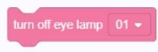

###  Acousto-optic building blocks

#### 1.	Play tone [C3], duration (100) milliseconds
  
● 	Explore's buzzer plays the specified tone and stops after running the specified time

#### 2.	Play frequency (400) Hz, duration (100) milliseconds
  
● 	Explore's buzzer plays a sound of a specified frequency and stops after running for a specified time

#### 3. End sound
  
● 	End all sounds of the current script

#### 4.	Onboard RGB light color is ()
  
● 	Explore's onboard RGB lights light up in specified colors

#### 5.	Onboard RGB light color is R (0) G (0) B ()
  
● 	The onboard light of Explore lights up the specified   
● 	color parameter range:    
    R：0~255  
    G：0-255   
    B：0-255  

#### 6.	Turn off the onboard RGB lights
  
● 	Turn off Explore's onboard RGB lights for the current script

#### 7.	Light up the eye lamp ID- [01], color ()
  
● 	The ID of the specified eye lamp lights up in the specified color, and the script execution will not stop

#### 8.	Light up the eye lamp ID- [01], color R (0) G (0) B (0)
  
● 	The specified eye lamp ID lights up in the specified color, and the script execution will not stop

#### 9.	Eye lamp ID- [01], custom light flap [color] duration (100) milliseconds until end
  
● 	The specified eye lamp ID lights up the color of the specified light petal and runs for the specified time

#### 10. Eyelight expression ID- [01], display expression [blink], color (), (1) times
  
● 	The specified eye lamp ID displays the expression of your specified color, and runs the specified number of times. At the same time, the following script

#### 11. Eye light ID- [01], scene light [colorful marquee light] (1) times
  
● 	The specified eyelight ID displays the unspecified scene light [Colorful Marquee / Disco / Three Primary Colors / Color Stacking], and runs the specified number of times while executing the following script

#### 12. Eyelight ID- [01], scene light [Colorful Marquee] (1) times until the end
  
● 	The specified eye light ID is displayed as the specified scene light [Colorful Marquee / Disco / Three Primary Colors / Color Stacking]. Until the specified number of times are completed, the following script will be executed.

#### 13.Turn off the eye light [01]
  
● 	Turn off the effect of the specified eye light
