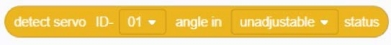
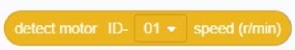
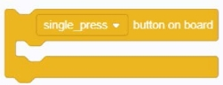
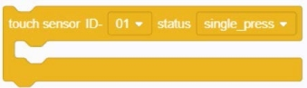
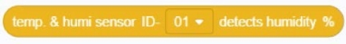
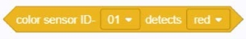

###  Perceptual building blocks

#### 1.	Line inspection sensor num- [01] detects [deep]
  

#### 2.	Read the angle of the servo ID- [01] when the status is [non-movable]
  
● 	Get the angle of the specified servo at [non-automatic / automatic]

#### 3.	Read the speed of motor ID- [01] (r / min)
  
●   Get the speed of the specified motor

#### 4.	uKit ultrasonic sensor ID- [01] ultrasonic ranging (cm)
  
● 	Get the distance of the specified uKit ultrasonic sensor using ultrasonic testing

#### 5.	uKit infrared sensor ID- [01] get distance
  
● 	Get the distance tested by the specified uKit infrared sensor

#### 6. Get the battery voltage
  
● 	Get the voltage value of the battery connected to the current Explore

#### 7. Gyroscope [Acceleration (m / s²)] Select [X axis]
  

#### 8.	The onboard status of the button is [click]
  
● 	If the on-board state of the button is [click / double-click / long press], the script building block included in the building block is executed, otherwise the building block is skipped

#### 9. Press sensor ID- [01] status is [click]
  
● 	If the status of the specified installation sensor is [click / double-click / long press], the script building block included in the building block is executed, otherwise the building block is skipped

#### 10. Press the sensor ID- [01] status is [click]
  
● 	When the status of the specified compression sensor is [click / double-click / long press], the condition of this building block is satisfied

#### 11. Brightness sensor ID- [01] obtains the brightness value (lux)
  
● 	Get the brightness value of the specified brightness sensor

#### 12. Sound sensor ID- [01] obtains the sound intensity value
  
● 	Get the sound intensity value of the specified sound sensor

#### 13. Humidity sensor ID- [01] Get humidity%
  
● 	Gets the humidity percentage of the specified humidity sensor

#### 14. Color sensor ID- [01] detects [R] value
  
● 	Get the [R / G / B] value of the specified color sensor.

#### 15. Color sensor ID- [01] detects that the color is [red]
  
● 	When the specified color sensor detects that the color is [Red], the condition of this building block is successful