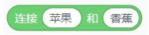

### 运算积木块	
#### 1.	（）+（）
  
●    获取参数A和参数B执行加法得到值

#### 2.（）-（）
  
●    获取参数A和参数B执行减法得到的值

#### 3.	（）*（）
  
●    获取参数A和参数B执行乘法得到的值

#### 4.（）/（）
  
●    获取参数A和参数B执行除法得到的值

#### 5.在（1）和（10）之间取随机数
  
●    在指定的数值范围随机抽取数字

#### 6.（）>（50）
  
●    当参数A大于参数B时，此积木条件成立

#### 7.（）<（50）
  
●    当参数A小于参数B时，此积木条件成立

#### 8.（）=（50）
  
●    当参数A等于参数B时，此积木条件成立

#### 9.（）与（）
  
●    当条件A和条件B同时成立时，此积木条件成立

#### 10.（）或（）
  
●    当条件A和条件B其中一个条件成立时，此积木条件成立

#### 11.（）不成立
  
●    当指定条件不成立时，此积木条件成立。

#### 12.连接（苹果）和（香蕉）
  
●    获取指定文本或数字结合在一起的结果

#### 13.（苹果）的第（1）个字符
  
●    获取指定文本或数字的指定位置的字符

#### 14.（苹果）的字符数
  
●    获取指定文本或数字的字符数

#### 15.（苹果）包含（果）？
  
●    当指定文本或数字A包含指定文本或数字B的内容，此积木块条件成立

#### 16.（）除以（）余数
  
●    获取参数A除参数B的余数的值

#### 17.四舍五入（）
  
●    获取指定数值四舍五入的值

#### 18.[绝对值]（）
  
●    获取指定运算的结果的值 运算法则：绝对值、向下取整、向上取整、平方根、sin、cos、tan、asin、acos、atan、In、log、e^、 10^
