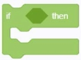
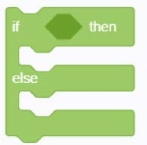
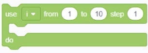
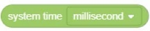

###  Logic building blocks

#### 1.	wait (1000) [ms]
  
● 	After waiting for the specified time, execute the following procedures

#### 2.	If () then
  
● 	If the embedding is true, execute the script block contained in the "if" block, otherwise skip this block

#### 3. If () then [] otherwise []
  
●   If the embedded <condition> is true, execute the script blocks contained in the "if" block, otherwise execute the script blocks contained in the "other" block

#### 4.	Use [i] to execute from (1) to (10) in steps of (1)
  

#### 5.	Repeat [when satisfied] () execute
  
● 	When the conditions in [Meet / Until] are satisfied, the contained script content is repeatedly executed

#### 6.	[Jump Out] Loop
  
● 	[Jump out \ Skip to next] The current script program interrupts the current loop

#### 7.	System running time [ms]
  
● 	Get the current program running time

#### 8.（50）[=]（50）
  
● 	If the specified parameter [equal / not equal / less than / less than / less than / greater than / greater than or equal to], the condition of this building block is satisfied

#### 9. () [and] ()
  
● 	If the specified conditions [and / or], this building block condition holds

#### 10. [True]
  
● 	If the condition is [true / false / empty], the condition of this building block is satisfied

#### 11. Not ()
  
● 	When the specified condition is not true, the condition of this building block is true

#### 12. Judge () if true () if false ()
  
● 	The judgment condition is true, execute the second parameter, otherwise execute the third parameter

#### 13. Judge () if true () if false ()
  
● 	When the judgment condition is false, execute the second condition, otherwise execute the third condition