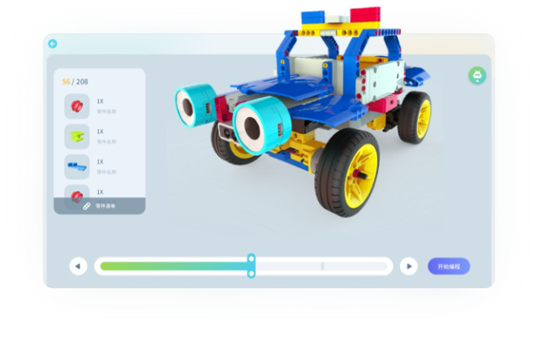

### 3D Building Instructions
    
uCode provides official custom UKIT Advanced models with 3D building instructions, 360 viewing to quickly build your own model. Users can enjoy the fun of robot building and at the same time subtly establish the thinking logic of spatial structure, laying the foundation for future AI.

    

