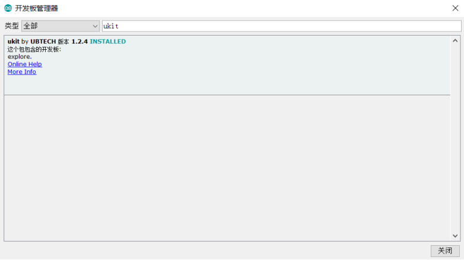
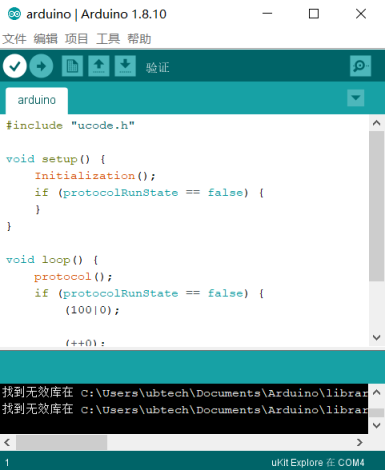

###  Arduino IDE使用说明

#### 第一步：
使用uCode启动Arduino  IDE，然后选择  工具->开发板->开发板管理  启动Arduino板管理器。再搜 索“uKit”并安装软件，安装需要一段时间才完成。  
  

#### 第二步：
安装完成之后，关闭弹框，然后打开  工具->开发板->选择当前的开发板。再打开  工具->选择正确的端 口。选择开发板和端口之后，Arduino   IDE右下角显示当前的连接的开发板  
  
