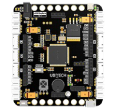
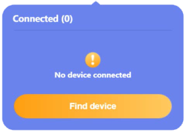
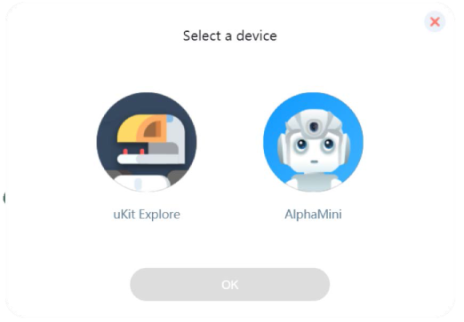
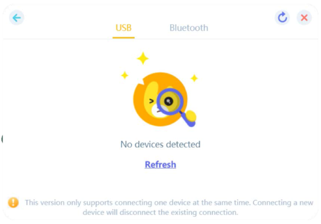
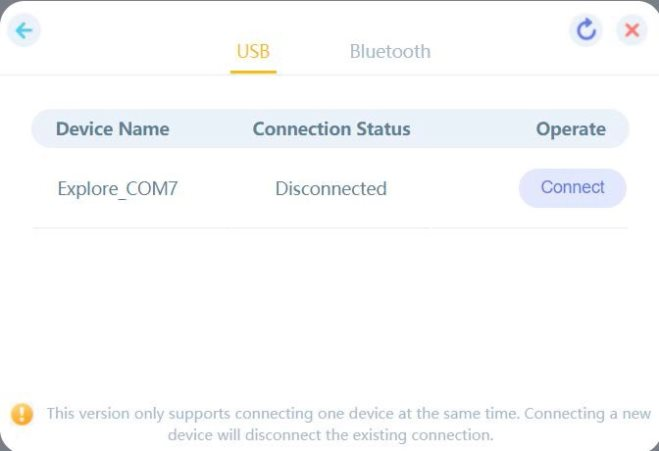

###  Explore connection
####  How to connect with UKIT Advanced board?
1.	Connect the hardware  
Use the data cable to connect the board to the computer. Note: the UKIT Advanced board is called Explore.  
    
2.	Find device  
Click Connect Device-Find Device in the upper right corner of the main interface  
     

3.	Select the hardware  
Connect the device page and select uKit Explore  
    

4.	Select the connection method  
Select the connection method, select USB connection or Bluetooth connection  
    

5.	Connect the device  
After entering the connection interface, find the device to be connected in the device list and click the Connect button  
    
