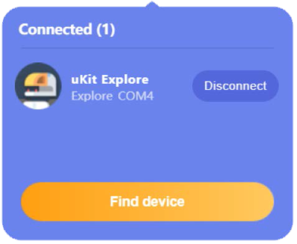
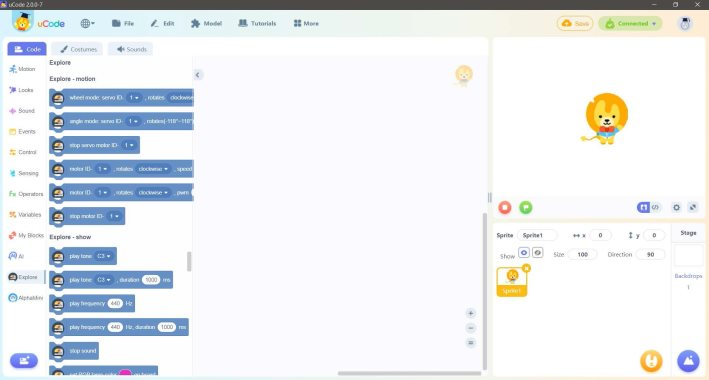
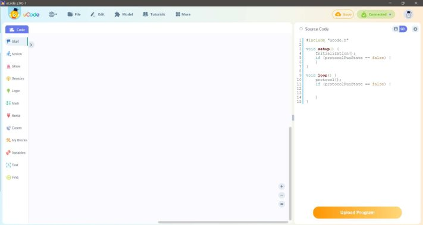

###  Upload Mode-Block Description
#### Upload mode
1.	When the hardware is successfully connected this will appear:  
    

2.	Click the Explore category under the code tab, and click the "Upload Mode" button above the stage area on the right  
    

3.	In upload mode, after programming with block code, click the "Upload" button to start programming and uploading to the Explore microcontroller.  
    
